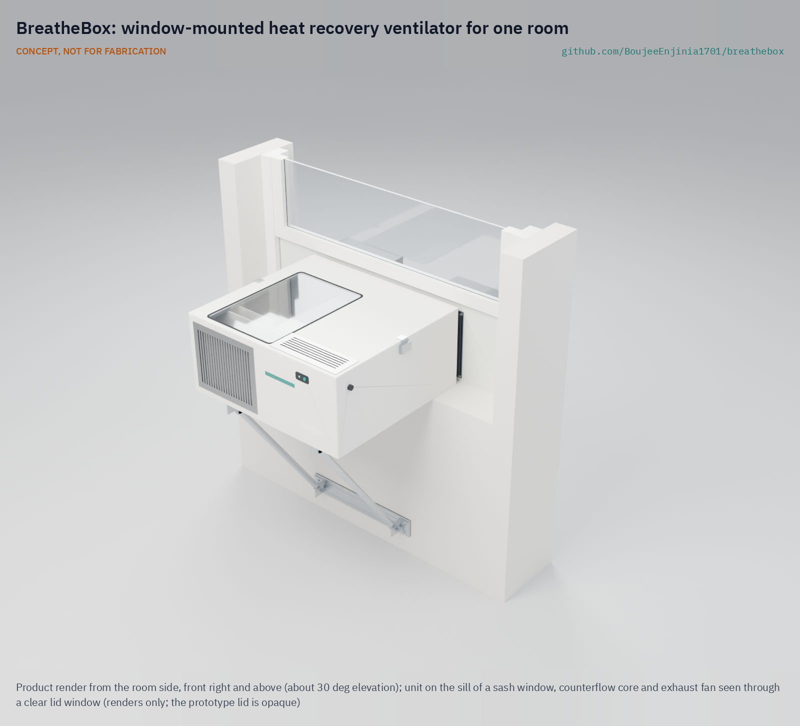
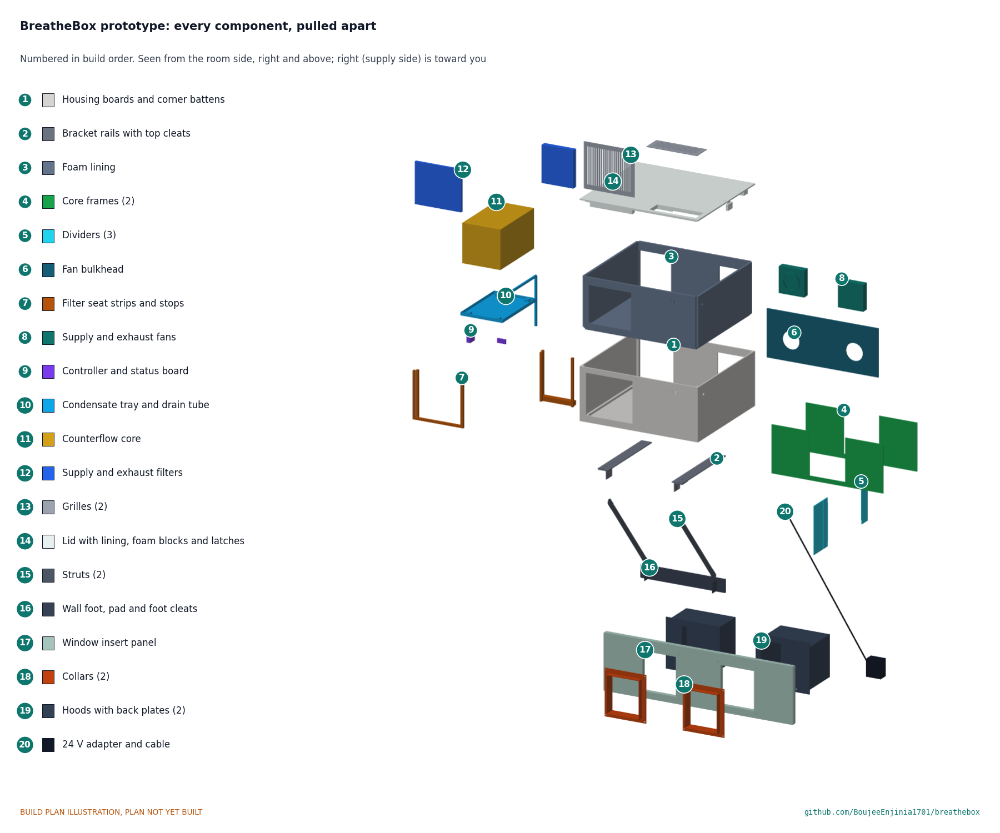

# BreatheBox

     

**Area:** Sustainable Housing · **TRL:** 3 of 9 (proof of concept on paper) · **Value-engineering target:** $255 USD · **Difficulty:** 3 of 5

A window-mounted heat recovery ventilator for single rooms: two small fans and a counterflow core bring in fresh air while recovering most of the heat or cool from the outgoing air.

[Exploded render](media/render-exploded.png) · [Detail render](media/render-detail.png) · [Interactive 3D model](media/viewer.html) · [Concept blueprint (PDF)](media/concept-blueprint.pdf) · [General arrangement BBX-DWG-001 (PDF)](cad/drawings/BBX-DWG-001.pdf) · [Sizing calculations](docs/04-calcs/01-sizing.md) · [Prototype build plan](docs/05-build-plan.md) · [Design decisions](docs/06-design-decisions.md) · [Review note](docs/REVIEW.md)

## Concept rationale

Most homes will never get a ducted whole-house ventilation system, but almost every room has a window. BreatheBox puts heat recovery where the fresh air already comes in: a small counterflow core and two small 24 V fans in a box that sits on the sill, with an insulated panel under the raised sash. Room air and outdoor air pass each other on opposite sides of thin plates, so the room gets filtered fresh air at close to room temperature instead of a cold draft. A CO2 sensor runs the fans only as hard as the room needs.

It is open and garage-buildable because the people who most need it (renters, social housing tenants, owners of older homes) are the least served by installer-only products. Apart from the core and the fans, the parts are foam board, filter media and a small controller. The design files let a community repair group or a housing provider build, adapt and fix units locally, and the firmware keeps data on the device.

## Burning platform

People live indoors, and indoor air is often the worse air. The US EPA notes that Americans spend about 90 % of their time indoors and that indoor concentrations of some pollutants are often 2 to 5 times higher than typical outdoor levels ([US EPA](https://www.epa.gov/report-environment/indoor-air-quality)). Opening a window is the usual fix, and it throws heat away: in the European Union, buildings use about 40 % of energy, about 80 % of energy in homes goes to heating, cooling and hot water, and 85 % of buildings were built before 2000 ([European Commission](https://energy.ec.europa.eu/topics/energy-efficiency/energy-performance-buildings/energy-performance-buildings-directive_en)).

The cost of getting this wrong is not only energy. In England, 7 % of social rented homes had a damp problem in 2023, and the death of two-year-old Awaab Ishak from prolonged mould exposure led to a law with fixed deadlines for landlords to fix damp and mould ([UK Government](https://www.gov.uk/government/news/awaabs-law-to-force-landlords-to-fix-dangerous-homes)). Outdoor air needs filtering too: 99 % of the world's population lived where WHO air quality guideline levels were not met in 2019 ([WHO](https://www.who.int/news-room/fact-sheets/detail/ambient-(outdoor)-air-quality-and-health)).

## Where it could be used

### By industry

| Industry | Use |
| --- | --- |
| Social and rental housing | Fast, reversible fix for damp and stuffy bedrooms without building work |
| Home energy retrofit | Adds controlled ventilation after air sealing and insulation of older homes |
| Student and worker residences | One unit per small room, where windows are often kept shut for noise or security |
| Small offices and consulting rooms | Fresh, filtered air for one or two people in rooms with no mechanical ventilation |
| Assisted living and home care | Steady ventilation for people who cannot easily open and close windows |
| Maker education and repair cafes | Teaching build of airflow, heat transfer and sensing with a useful result |

### By country or region

| Country or region | Why it matters there |
| --- | --- |
| Canada | Long, cold heating seasons; Health Canada sets a 1,000 ppm long-term CO2 guideline for homes and names ventilation as the main way to remove CO2 ([Health Canada](https://www.canada.ca/en/health-canada/services/publications/healthy-living/residential-indoor-air-quality-guidelines-carbon-dioxide.html)) |
| United States | Window air conditioners have made sash-window units a familiar renter fix; Americans spend about 90 % of their time indoors ([US EPA](https://www.epa.gov/report-environment/indoor-air-quality)) |
| United Kingdom | Damp and mould in 7 % of social rented homes and new legal deadlines for landlords to fix them ([UK Government](https://www.gov.uk/government/news/awaabs-law-to-force-landlords-to-fix-dangerous-homes)) |
| Germany and the wider EU | 85 % of buildings built before 2000 and 75 % with poor energy performance ([European Commission](https://energy.ec.europa.eu/topics/energy-efficiency/energy-performance-buildings/energy-performance-buildings-directive_en)); tilt-and-turn windows need a different insert |
| India | Filtered supply air for bedrooms kept shut against outdoor pollution; the WHO South-East Asia Region has among the greatest numbers of deaths from ambient air pollution ([WHO](https://www.who.int/news-room/fact-sheets/detail/ambient-(outdoor)-air-quality-and-health)); an enthalpy core would suit humid heat |
| China | Cold northern winters and polluted outdoor air in one place; the WHO Western Pacific Region also carries among the greatest numbers of those deaths ([WHO](https://www.who.int/news-room/fact-sheets/detail/ambient-(outdoor)-air-quality-and-health)) |

## What sparked the idea

The idea traces back to the Saskatchewan Conservation House, an experimental energy-efficient home built in northwest Regina in 1977 with the Saskatchewan Research Council as project manager. Its use of an air-to-air heat exchanger for ventilation was a pioneering effort, and such exchangers are now produced in the tens of thousands each year in North America ([Encyclopedia of Saskatchewan, University of Regina](https://esask.uregina.ca/entry/energy-efficient_houses.html)). That house showed that a tight, well-insulated home needs heat recovery ventilation designed in from the start. BreatheBox asks what the same exchanger looks like when it has to reach an existing room through a sash window, fitted and removed by a tenant, rather than being ducted into a new house.

## Problem

Sealed, efficient homes need ventilation, but opening windows wastes energy and whole-house heat recovery systems are expensive to retrofit.

## Concept

A window-mounted heat recovery ventilator for single rooms: two small fans and a counterflow core bring in fresh air while recovering most of the heat or cool from the outgoing air.

Full design precis: [docs/02-concept.md](docs/02-concept.md)

## Key components

1. Insulated housing that sits on the window sill
2. Counterflow plate core, about 80 % sensible recovery (estimate)
3. Two 24 V brushless blowers, 30 to 70 m³/h balanced, 50 m³/h nominal
4. ePM1 supply filter and coarse exhaust filter
5. Controller with CO2, humidity and temperature sensing, a frost mode and a quiet night mode
6. Condensate tray draining outdoors
7. Insulated window insert panel with seals, under the raised and locked sash
8. Two outdoor hoods with insect mesh, a sill bracket propped on the wall by a padded foot, and a certified 24 V plug-in adapter

TRL 3 calculations ([BBX-CAL-001](docs/04-calcs/01-sizing.md)): about 267 W of heat kept at 0 °C outdoors and 50 m³/h for about 5.7 W of fan and control power, about 11.4 kg installed, and $283 in parts. One requirement is not met, noise (about 39 dB(A) at 1 m at 50 m³/h against 30 dB(A)), and cost is $28 over the value-engineering target ($283 against the $255 target, after the design was made buildable). A quiet night mode at 32 m³/h brings the noise estimate to about 30 dB(A) with clean filters, with overnight CO2 near 1,300 ppm ([BBX-DDR-002](docs/decisions/0002-recommendations-accepted.md)). See the [design precis](docs/02-concept.md) and [requirements](docs/03-requirements.md).

The priced bill of materials is in [bom/bom.csv](bom/bom.csv). The parametric model is `cad/src/model.py`, with STEP and STL exports in `cad/step/` and `cad/stl/`.

## Building the prototype

The [prototype build plan](docs/05-build-plan.md) (BBX-BLD-001) shows, in pictures, how to make each of the twenty components and put them together in sixteen steps; nothing has been built yet. The housing is PVC foam board on corner battens with a foam lining, partitions that keep the four air streams apart and a fan bulkhead; the window insert is a panel with flanged collars and hoods bolted through it; the bracket is two rails and two flattened-end struts on a padded wall foot. Writing the plan made the design buildable: joints, seats, partitions, grilles and fixings were added and the bracket was made rigid (BBX-DDR-003, open for Amish's review), and what is still to be decided is in the [design decisions register](docs/06-design-decisions.md). Every picture is drawn from the model, which checks that each part touches what it should and clears what it should not.

## Safety

> The unit runs on 24 V from a certified plug-in adapter; do not open the adapter or add mains wiring. Do not use it in a room with an open-flued or unflued fuel-burning appliance, because frost mode extracts more air than it supplies. Lock the raised sash onto the insert panel and never install from outside above ground level. Fan impellers can cut fingers: unplug before opening the lid.

## Repository layout

| Folder | Contents |
| --- | --- |
| `docs/` | Problem, concept, requirements, calculations and design decisions |
| `cad/src/` | build123d Python source, the source of truth for all geometry |
| `cad/step/`, `cad/stl/` | Exported models for FreeCAD, other CAD tools and printing |
| `cad/drawings/` | 2D sketches and dimensioned drawings |
| `bom/` | Bill of materials |
| `electronics/` | KiCad schematics and PCB layouts |
| `firmware/` | Microcontroller code |
| `media/` | Renders, perspectives and photos |
| `build-log/` | Dated prototyping notes |

## Documentation

Controlled documents follow the portfolio [documentation standard](.kit/STANDARDS.md). Each carries a document ID (BBX-PRC-001 for the precis), a version and a revision history. Branded PDFs are built with `python .kit/render.py` and attached to GitHub Releases when a document is tagged, for example `BBX-PRC-001/v1.0`.

## Credits

Designed by Amish Chadha, with contributions from Ashok Kumar Chadha. See [CONTRIBUTORS.md](CONTRIBUTORS.md) for roles. To cite this design, use [CITATION.cff](CITATION.cff) (GitHub shows it as "Cite this repository").

AI assistance (Claude) was used to accelerate concept renders, prototype documentation and first-pass sizing calculations. Design direction and all decisions are Amish Chadha's, recorded in this repository's decision records (`docs/decisions/`).

## Licenses

- **Hardware** (CAD, drawings, BOM, electronics): [CERN-OHL-S v2](LICENSE)
- **Software** (firmware, scripts, notebooks): [MIT](LICENSE-SOFTWARE)

A project of the [Design Molecule](https://designmolecule.com) lab.
