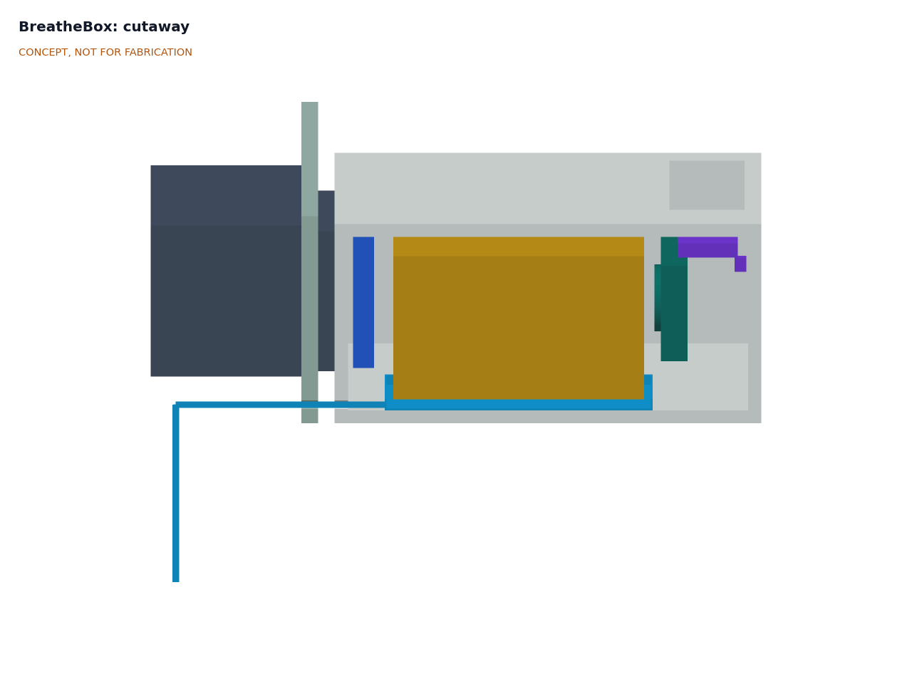
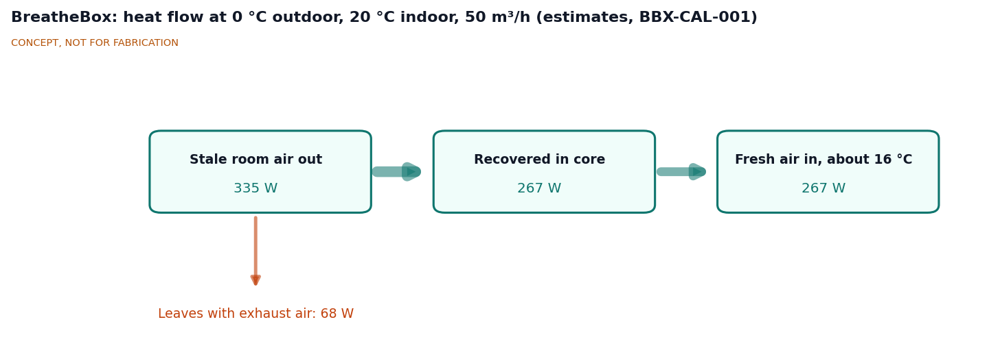
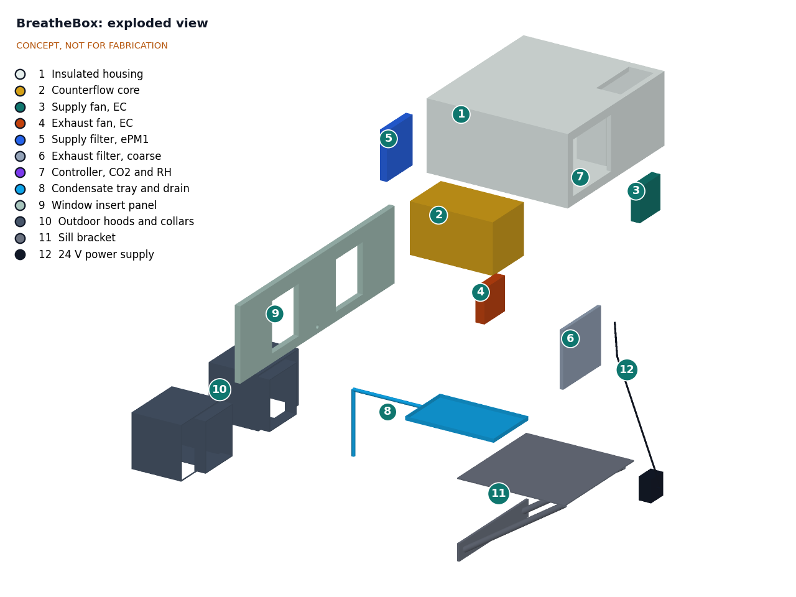

# BreatheBox design precis

## Summary

BreatheBox is a single-room heat recovery ventilator that sits on the sill of a sash window. Two small 24 V blowers push stale room air out and draw fresh air in through a counterflow plate core, so the incoming air picks up about 80 % of the heat (or, in summer, the cool) of the outgoing air. The TRL 3 calculations (BBX-CAL-001) give, for a bedroom at 50 m³/h and 0 °C outdoors: about 267 W of heat kept in the room for about 5.6 W of fan and control power, supply air at about 16 °C, and CO2 near 980 ppm overnight with two sleepers. Two requirements are not met: noise (about 39 dB(A) at 1 m against 30 dB(A)) and cost ($255 against the $220 budget). All figures are paper estimates; nothing has been built.

Figure 1. Parametric model on a sash window, with a 1.75 m person for scale.

## How it works

1. **Mount.** A 20 mm insulated panel fills the gap under the raised lower sash, which closes down onto it and is locked. The housing (510 x 560 x 250 mm) rests 110 mm on the sill and projects 400 mm into the room, where a clamped bracket with a padded wall foot carries it; nothing is drilled.
2. **Exhaust path.** Room air enters a front grille, passes a coarse filter, and the exhaust fan blows it through one set of core channels, across the outdoor plenum and out of a downward-facing hood.
3. **Supply path.** Outdoor air enters the second hood, 420 mm from the exhaust mouth, passes through a collar in the panel and an ePM1 filter, and flows through the other set of core channels. The supply fan draws it through the core and blows it into the room through a top grille that throws air up and away from the occupant.
4. **Recover.** The two streams flow in opposite directions on each side of thin polymer plates, so heat passes across without the air mixing.
5. **Drain.** In winter, moisture from the room air condenses in the core. A tray under the core falls to the outdoor side, and a tube carries the water through the panel and down the outside wall.
6. **Control.** A small controller reads CO2, humidity and temperature at the room intake and runs the fans between 30 and 70 m³/h, using the fan tach signals to keep the two streams within 10 %. A temperature probe at the core's exhaust outlet triggers a frost mode that slows the supply fan when the cold corner of the core nears 0 °C. Readings show on a status LED and, optionally, on a local web page; nothing needs the cloud.

Figure 2. Cutaway through the supply side: hood and collar (outdoors, left), insert panel, supply filter, core over the condensate tray, supply fan and controller.

The general arrangement is drawing BBX-DWG-001 (Rev P1) in `cad/drawings/`, generated from `cad/src/model.py`.

## Main components

Table 1. Main components. Numbers match `bom/bom.csv` and Figure 4.

| # | Component | Choice for TRL 3 | Notes |
| --- | --- | --- | --- |
| 1 | Insulated housing | PVC foam board shell with 10 mm foam lining, 510 x 560 x 250 mm, dividers for the four air paths | Lift-off lid for filters |
| 2 | Counterflow core | Polymer plate core 180 x 180 x 300 mm, about 2.5 mm plate pitch | Bought spare-part HRV core; washable |
| 3, 4 | Supply and exhaust fans | 24 V brushless centrifugal blowers, 120 x 120 x 32 mm class, about 100 m³/h free air and 400 Pa shut-off, PWM with tach | Larger than at TRL 2 (see BBX-CAL-001 section 4) |
| 5 | Supply filter | ISO 16890 ePM1 50 % pleated panel, 150 x 170 x 25 mm, at the supply port | Replace about every 6 months or at twice the clean pressure drop |
| 6 | Exhaust filter | Coarse washable pad, 220 x 190 mm | Keeps lint off the core |
| 7 | Controller | ESP32-C3 class module with a Sensirion SCD41 class CO2, humidity and temperature sensor and two NTC probes | Check the sensor on the lab's CalRig before use |
| 8 | Condensate tray and drain | PETG tray, 12 x 8 mm tube to outdoors | Falls outward |
| 9 | Window insert panel | 20 mm insulated panel with EPDM edge seals, trimmed to 700 to 1,000 mm | Sash locks onto it |
| 10 | Outdoor hoods and collars | Two PVC hoods with 1 mm stainless mesh on 130 mm wide mouths, 420 mm apart; collars through the panel | Mouths face down |
| 11 | Sill bracket | Aluminium plate and two tube struts to a padded wall foot | Clamps; no drilling |
| 12 | Power supply | Certified 24 V, 1.5 A plug-in adapter; 2 A fuse on the 24 V input | No mains wiring in the unit |

## Key numbers

All values come from BBX-CAL-001 and `docs/04-calcs/sizing.py`, with the assumptions stated there. They are estimates for a paper design.

Table 2. Key numbers at TRL 3.

| Quantity | Estimate | Requirement |
| --- | --- | --- |
| Core effectiveness | 79.8 % at 50 m³/h; 73.8 % at 70 m³/h | R2 met on paper |
| Heat recovered at 0 °C outdoors, 50 m³/h | 267 W of 335 W; 68 W lost; supply air 16.0 °C | |
| Supply pressure drop at 50 m³/h | 51.8 Pa clean, 79.0 Pa with loaded filter | |
| Flow limit at full fan speed | 80 m³/h per stream with loaded filters | R1 met on paper |
| Fan and control power | 5.6 W at 50 m³/h (7.4 W loaded); 14.5 W at 70 m³/h loaded | R3 met on paper |
| Noise at 1 m | About 39 dB(A) at 50 m³/h; 30 dB(A) near 32 m³/h | **R6 not met** |
| Heating-season energy kept | About 1,123 kWh for 28 kWh of fan energy (3,500 K·d) | |
| CO2, two sleepers, 30 m³ room | 980 ppm overnight and 607 ppm 24 h mean at 50 m³/h | R4 met on paper |
| Condensate, upper bound | 0.21 L/h (70 m³/h, -3 °C) | R7 drain sized |
| Frost onset | About -2.2 °C outdoors at 50 m³/h | |
| Frost mode at -10 °C | Supply slowed to 33 % of exhaust; about 2.2 Pa room depressurization through a door undercut | R7 met on paper |
| Clear distance between hood mouths | 420 mm; hoods fit windows from 686 mm clear width | R11, R8 met on paper |
| Unit mass | About 10.5 kg installed (10.8 kg with adapter) | R9 mass met on paper |
| Parts cost | $255 | **R15 not met** ($220; $250 proposed) |

Figure 3. Heat flow in the design case (estimates from BBX-CAL-001).

## Key design choices

Each choice below was recommended at TRL 2 and is adopted for TRL 3 under Amish's 2026-09-25 instruction, open for his review (BBX-DDR-001).

- **Window insert rather than wall core; sash windows first** (item A2). Renters can install it, and it comes out without a trace. The first version fits vertical sliding sash windows from 700 to 1,000 mm clear width, with an adapter for horizontal sliders. Casement and tilt-and-turn windows need a later insert.
- **Bought polymer counterflow plate core** (item A3). A plate core runs one steady fan per stream, is simple to model and build, and keeps supply and exhaust separate. The core is the part a garage builder cannot make well; a home-made crossflow core would cost about $10 but recover only about 50 to 65 % (estimate). Alternating regenerative units and enthalpy cores remain options for later variants.
- **Frost by slowing the supply fan** (item A4). The simplest frost strategy for a 24 V unit: holding balanced flow at -10 °C with a preheater would take about 130 W. It unbalances the flows and slightly depressurizes the room (see Safety).
- **50 m³/h nominal with CO2-driven boost to 70 m³/h** (item A5). The boost is rarely needed for R4 but costs noise (about 45 dB(A) at 70 m³/h with clean filters).
- **Single ESP32-C3 class controller with an SCD41 class sensor** (item A6), with the sensor checked on CalRig.
- **24 V SELV only.** A certified plug-in adapter means no mains wiring for the builder (R10).

One layout point is noted for review: both fans sit in the warm room-end plenum, so the exhaust side of the core runs at a slightly higher pressure than the supply side. Any core leakage would carry stale air into the supply stream.

Figure 4. Exploded view with BOM numbers.

## Safety

> **Safety:** Do not use BreatheBox in a room with an open-flued or unflued fuel-burning appliance (gas fire, oil or wood stove, water heater). In frost mode the unit extracts more air than it supplies and could draw combustion gases into the room. Do not install it in a room whose door seals airtight, because the depressurization would then be much larger than the 2 to 4 Pa estimated for a door with an undercut.

> **Safety:** The raised sash must be locked onto the insert panel. An unlocked sash is a security risk, and a loose panel or hood could fall outward from an upper floor. Check the bracket and panel before leaving the unit unattended, and never install from outside above ground level.

> **Safety:** Use only a certified 24 V SELV plug-in adapter, with a 2 A time-delay fuse on the low-voltage input. Do not open or modify the adapter. Keep the cable clear of the sash and of the condensate tube.

- Foam and plastics in the housing burn; choose fire-retardant grades and keep the unit away from heaters and curtains near heat sources.
- Fan impellers can cut fingers: guards or grilles on both room openings, and disconnect power before opening the lid.
- The drain tube can freeze outdoors in long cold spells; route it to fall continuously and check it in winter.
- Clean the tray and replace filters on schedule; standing water and wet filters can grow mould.
- The CO2 reading is a ventilation indicator only and is not a health or medical measurement.

## Open questions after TRL 3

- Noise: which fan, silencer or night-mode option closes the R6 gap (see `docs/REVIEW.md`)?
- Core: which spare-part cores are available at this size, and what are their real effectiveness and pressure drop?
- Fans: the chosen blower's curve, efficiency and noise data, to replace the class values in BBX-CAL-001.
- Airtightness: how much air leaks around the insert panel and sash, and does it matter for balance?
- Window survey: what share of the first users' windows are sash, slider, casement or tilt-and-turn?

Concept media: [blueprint sheet](../media/concept-blueprint.pdf), [interactive 3D model](../media/viewer.html). General arrangement: [BBX-DWG-001](../cad/drawings/BBX-DWG-001.pdf).
