# BreatheBox prototype build plan

**Plan, not yet built.** How to build the first proof-of-concept prototype, component by component. Building and testing to it is TRL 4 work. Decisions still to be made are kept in the design decisions register ([docs/06-design-decisions.md](06-design-decisions.md)), not here.

## 1. What you are building

*Figure 1. Every component pulled apart and numbered in build order. The window insert (17 to 19) is built on the bench and fitted to the window, and the sash jammer (21) wedged above the sash, before the unit goes on the sill.*

The prototype is one BreatheBox for a sash window: a lined box 510 x 560 x 250 mm that sits on the sill and holds a counterflow core, two small 24 V fans, two filters and a controller, plus a window insert that fills the gap under the raised lower sash and carries two outdoor hoods. Figure 1 shows the 21 components in the order you make or fit them. Fourteen are made in a home workshop: the housing boards and battens, the foam lining, the core frames, dividers and fan bulkhead, the filter seats, the condensate tray, the grilles and the lid; the bracket rails, struts and wall foot; and the insert panel, collars and hoods. The core, fans, filters, controller, adapter and sash jammer are bought. The work is cutting and gluing PVC foam board and foam, bending one PETG tray, cutting, drilling and bending aluminium bar, angle and tube, and plugging bought modules together at 24 V. The parts cost about $294 from the bill of materials.

> **Safety:** The unit runs only from a certified 24 V plug-in adapter; there is no mains wiring in it. Fan impellers can cut fingers: unplug the adapter before opening the lid. Do not use the unit in a room with an open-flued or unflued fuel-burning appliance, or in a room whose door seals airtight. Fit the window insert from inside only; never work outside a window above ground level. PVC cement and contact adhesive give off solvent fumes, and a heat gun on PETG gives off fumes: work in a ventilated space. Cut aluminium edges are sharp: deburr everything.

## 2. What changed to make it buildable

The concept showed what the unit does; most of its parts could not be made, fixed or sealed as drawn. Each change below keeps what the unit does, and all of them are recorded in decision record BBX-DDR-003, which Amish accepted on 2 October 2026.

*Table 1. Changes from the concept.*

| Component | The concept had | The buildable design has | Why |
| --- | --- | --- | --- |
| Housing | One solid shell with no joints and no separate lid | Six boards glued and screwed into corner battens, a foam lining, and a lid with a foam plug and two latches (Figures 2, 3, 19 and 20) | It can be made, and the lid lifts off for filter changes |
| Air paths | Air could pass round the core's sides; the dividers stopped short of floor and lid | Two core frames and three full-height dividers (Figures 7 to 9) | Four sealed chambers, with the core the only way between them |
| Fans | Each fan's inlet and outlet in one open chamber | A fan bulkhead: supply fan on its room side, exhaust fan on its core side, both still at the room end (Figures 10 and 11) | Each fan draws from one chamber and blows into the next |
| Core | Floating 8 mm above the tray | Four pads in a tray between the core frames; a foam hold-down under the lid (Figures 8 and 16) | The core is held, water runs under it, and it lifts straight out |
| Filters | Floating, with no seat | Strip seats with lips and stops; foam blocks under the lid (Figures 12, 13 and 13a) | The air presses each filter onto its seat |
| Controller | Floating above a divider, its sensor across two air streams | On the divider in the room-air intake; status light and button behind the room face (Figure 14) | The sensor reads room air |
| Grilles | None in the parts list | Two slotted aluminium grilles; the top opening moved over the supply fan (Figure 18) | Fingers cannot reach a fan |
| Collars and hoods | No fixing to the panel or the housing | Flanged collars and hood back plates bolted through the panel; the collar slides into the housing (Figures 25 to 27) | The insert is one rigid assembly and the hoods cannot fall |
| Sill bracket | A plate with tube struts touching it, no joints; a foot 650 mm up | Two rails bolted under the housing; flattened struts with two bolts at each end on angle cleats; a padded foot 400 mm up (Figures 4, 5 and 21 to 23) | The bracket is rigid and the unit needs half the sill friction to stay put |
| Drain | Through a divider, starting above the tray floor | From the tray's end wall at floor level, on the exhaust side (Figures 16 and 17) | No standing water; no divider pierced |
| Power entry | Beside the core, in a closed space | A cable gland in the right side wall (Figure 14) | The cable never crosses the core seal |

## 3. Making the components

Make and check each component before the assembly step that needs it. Sizes are in millimetres. "Left" and "right" are as seen standing in the room, looking at the unit's room face; the right side is the supply side. "Up" is from the bottom edge of the part. Workshop tolerance is 1 mm on board and foam and 0.5 mm on aluminium unless a step says otherwise; drawings do not carry tolerances before TRL 4.

### 3.1 Housing boards and corner battens

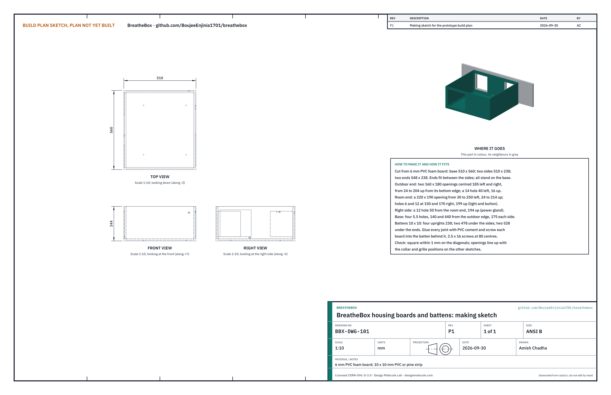

*Figure 2. Housing boards and battens making sketch (BBX-DWG-101).*

**What it is and what it is made from.** The outer box, without its lid: a base, two sides and two ends of 6 mm PVC foam board, joined over 10 x 10 mm strip battens in the corners. Fire-retardant board where you can get it.

**How to make it.**

1. Cut the boards with a sharp knife against a steel rule (several light passes): base 510 x 560; two sides 510 x 238; two ends 548 x 238.
2. Outdoor end: two openings 160 x 180, centred 185 left and 185 right of the centre line, from 24 to 204 up; a 14 hole 40 left of centre, 16 up (drain).
3. Room end: one opening 220 x 190, from 30 to 250 left of centre and 24 to 214 up (exhaust grille); a 6 hole at 150 right and a 12 hole at 170 right, both 199 up (status light and button).
4. Right side: a 12 hole 50 from the room end, 194 up (power cable gland).
5. Base: four 5.5 holes, 140 and 440 from the outdoor edge, 175 each side of the centre line (bracket rail bolts).
6. Cut the battens from 10 x 10 strip: four uprights 238 long, two 478 long (under the sides), two 528 long (under the ends).
7. On a flat bench, glue the bottom battens to the base 6 in from its edges, then the sides onto the base against their battens, then the ends between the sides, then the four uprights in the corners. Use PVC cement, and screw each board into the batten behind it with 3.5 x 16 stainless screws at about 80 centres, pilot drilled 2.5.

**How it fits the parts next to it.**

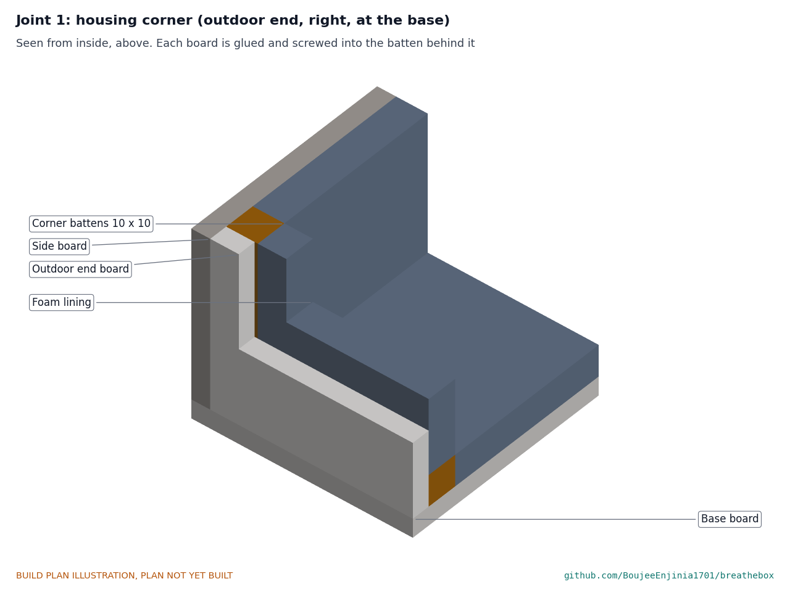

*Figure 3. Each board is glued and screwed into the batten behind it; the lining fills the space between the battens, so the inside is smooth.*

The ends fit between the sides and everything stands on the base. The battens lie inside the 10 mm lining's thickness, so the lining butts against them (section 3.3).

**Check before moving on.** The box is square: its two diagonals across the top differ by 1 mm or less. The collar openings are 370 apart, centre to centre.

### 3.2 Bracket rails with their top cleats

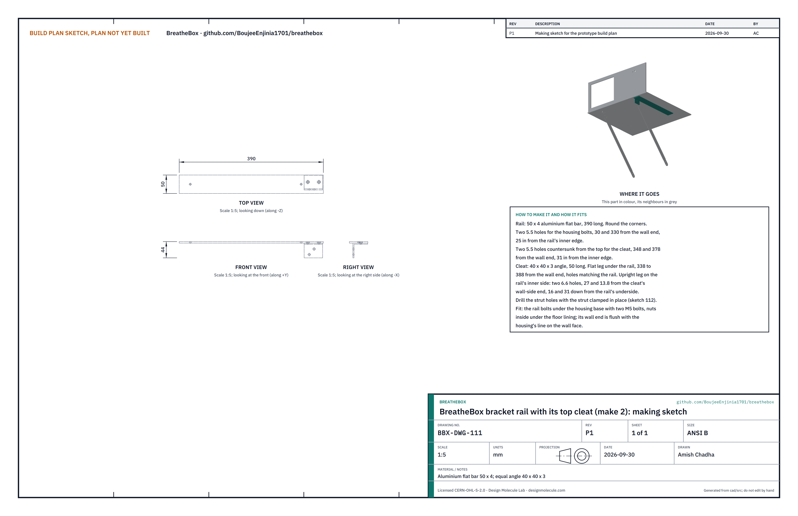

*Figure 4. Bracket rail with its top cleat making sketch (BBX-DWG-111). Make two, a left and a right.*

**What it is and what it is made from.** Two rails bolted under the housing base; at the room end of each, an angle cleat carries the top of a strut. Aluminium flat bar 50 x 4 and equal angle 40 x 40 x 3, 6060 or 6063 class.

**How to make it.**

1. Cut two rails 390 long; round the corners and deburr.
2. Drill two 5.5 holes in each, 30 and 330 from the wall end, 25 in from the inner long edge, for the housing bolts.
3. Drill two 5.5 holes 348 and 378 from the wall end, 31 in from the inner edge, and countersink them from the top so M5 countersunk screws sit flush.
4. Cut two cleats 50 long from the angle. Lay the flat leg under the rail from 338 to 388 from the wall end, upright leg on the inner side, and drill through the rail holes.
5. Leave the upright leg's strut holes until the struts are made (section 3.12); mark them now at 27 and 15.5 from the cleat's wall-side end, 16 and 32.4 down from the rail's underside.
6. Fit each cleat with two M5 countersunk screws and nyloc nuts.

**How it fits the parts next to it.**

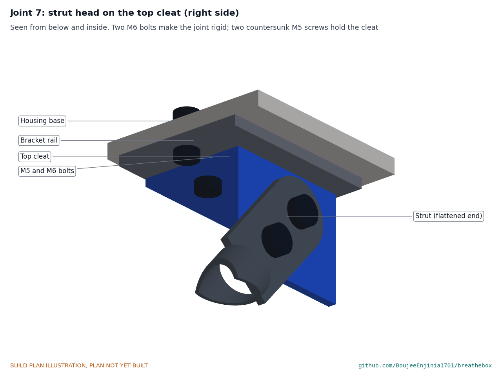

*Figure 5. The strut's flattened end bolts to the cleat's upright leg with two M6 bolts, so the joint cannot turn.*

The rails lie flat under the housing base, 150 to 200 out from the centre line on each side, with their wall ends at the line where the base meets the wall face (110 in from the outdoor edge of the base). Two M5 bolts each, heads under the rail, nyloc nuts and penny washers inside the box. The nuts go on before the lining, which has relief holes over them.

**Check before moving on.** The rails are parallel and both stand 4 below the base all along.

### 3.3 Foam lining

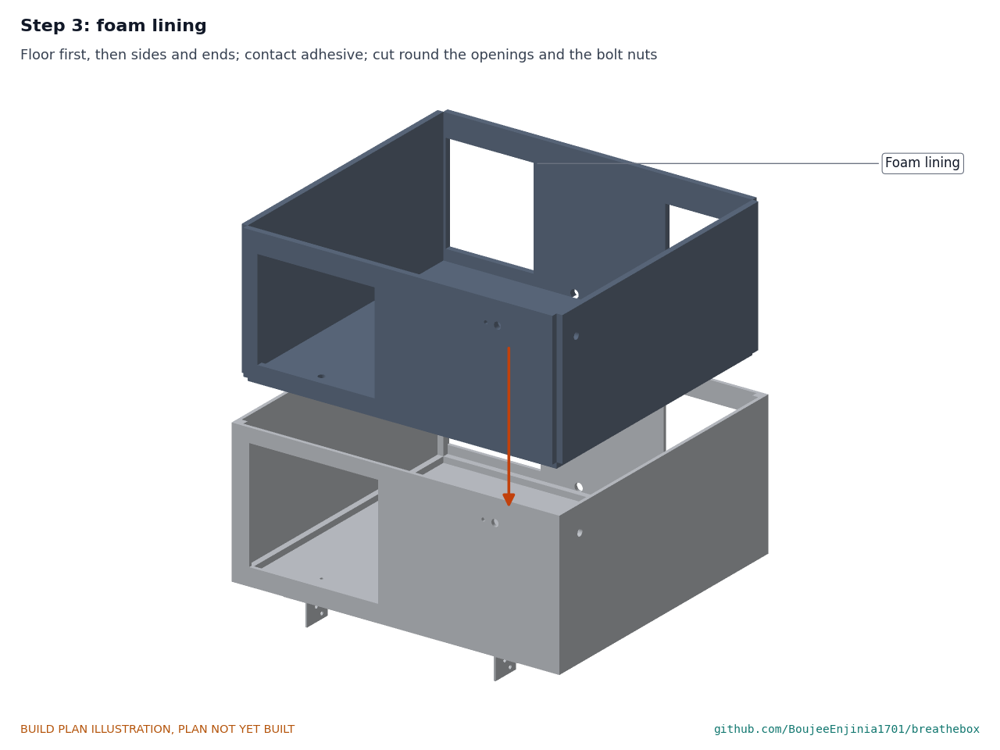

*Figure 6. The lining covers the floor, sides and ends inside the battens.*

**What it is and what it is made from.** 10 mm closed-cell foam sheet (self-adhesive, or plain with contact adhesive), fire-retardant grade where available. It insulates the box and quietens the fans.

**How to make it.**

1. Cut the floor piece 478 x 528, with four 12 relief holes over the bracket bolt nuts: 124 and 424 from its outdoor edge, 175 each side of centre.
2. Cut two side pieces 478 x 228. The right one has a 12 hole 34 from its room end, 184 up, for the cable gland.
3. Cut two end pieces 528 x 228.
4. Outdoor end piece: a 140 x 160 opening from 115 to 255 right of centre and 24 to 184 up (5 smaller all round than the collar bore, so it makes a lip behind the supply filter); a 150 x 170 opening from 110 to 260 left of centre and 19 to 189 up; a 14 hole 40 left of centre, 6 up.
5. Room end piece: a 200 x 170 opening from 40 to 240 left of centre and 24 to 194 up (a 10 lip behind the exhaust filter); holes 6 and 12 at 150 and 170 right, 189 up.
6. Lay the floor first, then the sides, then the ends, each pressed into place against the battens.

**How it fits the parts next to it.** It lies flat on the boards and butts against the battens; the openings line up with those in the boards, with the lips standing in from the supply opening and the exhaust grille opening.

**Check before moving on.** The inside measures 478 x 528 at the floor, and the lips are even all round their openings.

### 3.4 Core frames

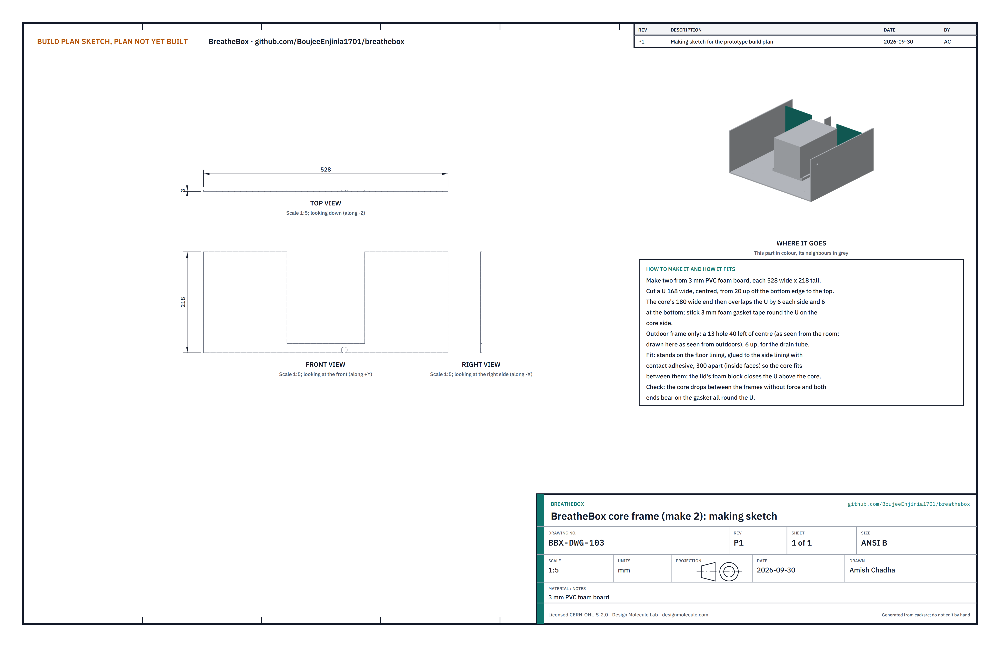

*Figure 7. Core frame making sketch (BBX-DWG-103). Make two.*

**What it is and what it is made from.** Two partitions across the box, one at each end of the core, with a U cut that the core's end bears on. 3 mm PVC foam board.

**How to make it.**

1. Cut two pieces 528 wide x 218 tall.
2. Cut a U 168 wide, centred, from 20 up to the top edge.
3. Outdoor frame only: a 13 hole 40 left of centre, 6 up, for the drain tube.
4. Stick 3 mm foam gasket tape round the U on the face that will touch the core.

**How it fits the parts next to it.**

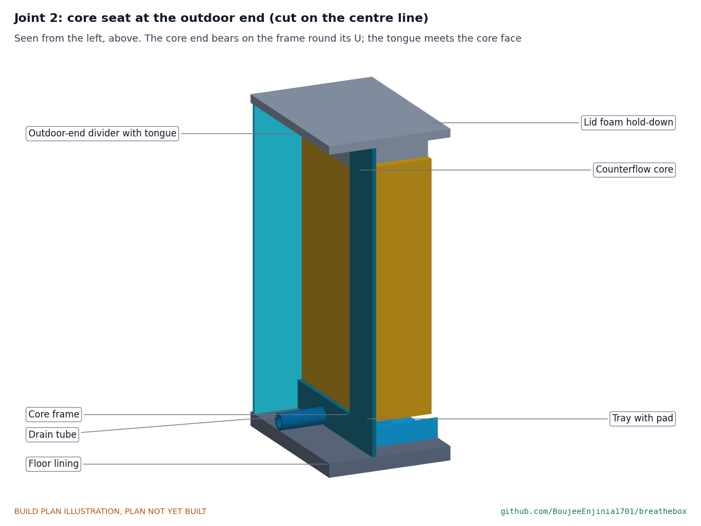

*Figure 8. The core's end bears on the frame round its U, through the gasket; the divider's tongue meets the core face; the lid's foam block closes the U above the core.*

Each frame stands on the floor lining and is glued to the side linings with contact adhesive. Their core faces are 300 apart, the core's length; the outdoor frame's core face is 70 in from the outside of the outdoor end board, which leaves 51 of clear space between the frame and the end lining. The tray sits between the frames (section 3.9).

**Check before moving on.** The core drops between the frames without force and bears on the gasket at both ends.

### 3.5 Dividers

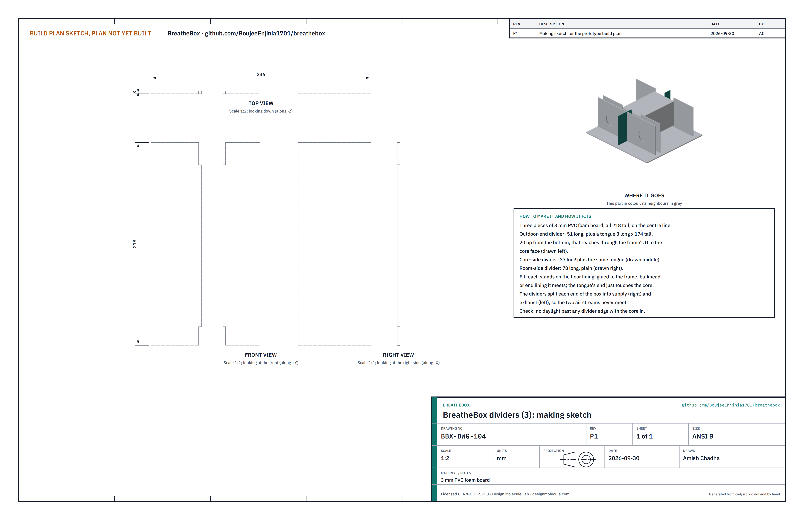

*Figure 9. Dividers making sketch (BBX-DWG-104): outdoor-end divider (left), core-side divider (middle), room-side divider (right).*

**What it is and what it is made from.** Three partitions on the centre line that split each end of the box into a supply side (right) and an exhaust side (left). 3 mm PVC foam board.

**How to make it.**

1. Outdoor-end divider: 51 long x 218 tall, with a tongue 3 long x 174 tall starting 20 up, on the core end.
2. Core-side divider: 37 long x 218 tall, with the same tongue on its core end.
3. Room-side divider: 78 long x 218 tall.

**How it fits the parts next to it.** Each stands on the floor lining on the centre line. The outdoor-end divider runs from the outdoor end lining to the core frame; its tongue passes through the frame's U and just touches the core's end. The core-side divider runs from the room-end core frame to the fan bulkhead, its tongue likewise touching the core. The room-side divider runs from the bulkhead to the room end lining. Glue each to what it meets.

**Check before moving on.** With the core in, no daylight shows past any divider edge.

### 3.6 Fan bulkhead

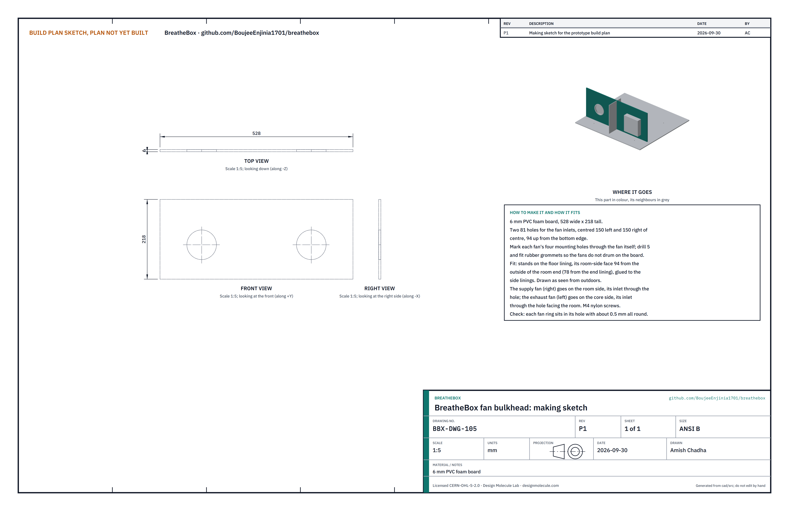

*Figure 10. Fan bulkhead making sketch (BBX-DWG-105), drawn as seen from outdoors.*

**What it is and what it is made from.** A partition across the room end of the box that carries both fans. 6 mm PVC foam board.

**How to make it.**

1. Cut 528 wide x 218 tall.
2. Cut two 81 holes for the fan inlets, centred 150 left and 150 right of centre, 94 up.
3. Hold each fan in place and mark its four mounting holes through the fan; drill 5 and fit rubber grommets.

**How it fits the parts next to it.**

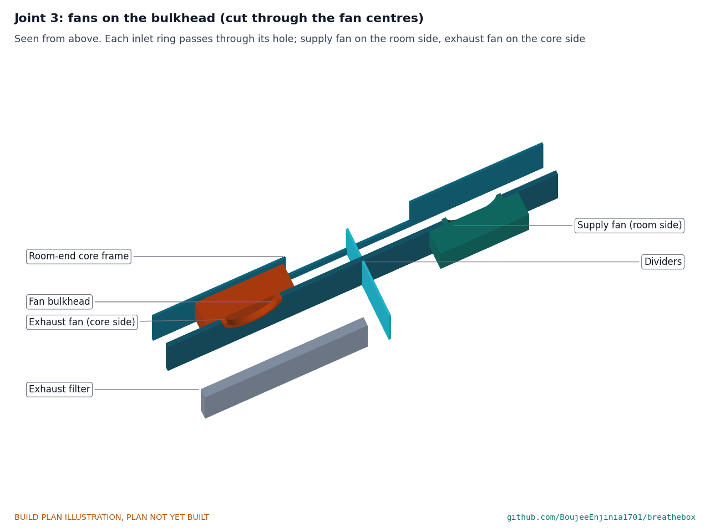

*Figure 11. Seen from above, cut through the fan centres: the supply fan sits on the room side with its inlet through the bulkhead; the exhaust fan sits on the core side with its inlet facing the room.*

The bulkhead stands on the floor lining with its room-side face 94 in from the outside of the room end board, glued to the side linings. The exhaust fan sits 2 clear of the room-end core frame.

**Check before moving on.** Each fan's inlet ring sits in its hole with about 0.5 all round.

### 3.7 Filter seats

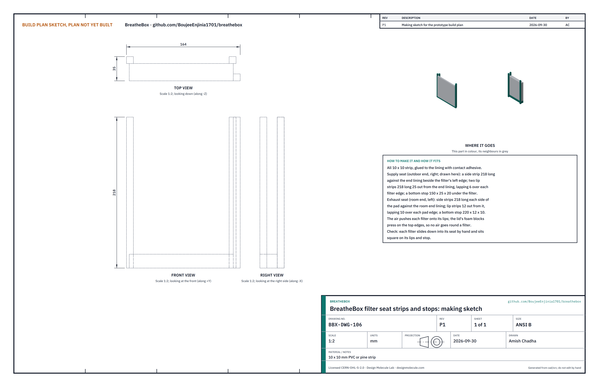

*Figure 12. Filter seat making sketch (BBX-DWG-106); the supply seat is drawn.*

**What it is and what it is made from.** Short lengths of 10 x 10 strip that hold each filter in place: side strips beside the filter, lip strips that lap over its downstream face, and a stop under it.

**How to make it.**

1. Supply seat (outdoor end, right): a side strip 218 long against the end lining beside the filter's left edge; two lip strips 218 long, 25 out from the end lining, lapping 6 over each filter edge (the right one against the side lining); a bottom stop 150 x 25 x 20 under the filter (two strips stacked).
2. Exhaust seat (room end, left): side strips 218 long each side of the pad against the room end lining; two lip strips 218 long, 12 out from the lining, lapping 10 over each pad edge; a bottom stop 220 x 12 x 10.
3. Glue them to the lining with contact adhesive, trying each filter in its seat before the glue sets.

**How it fits the parts next to it.**

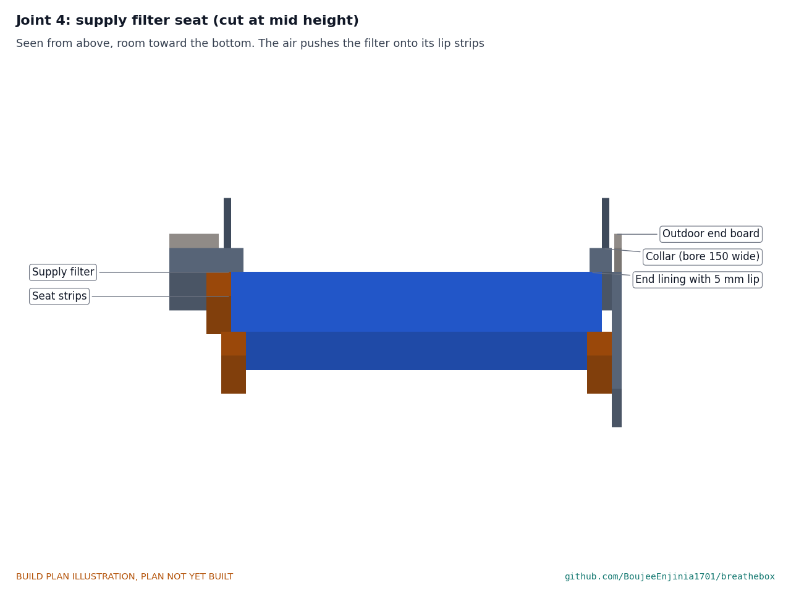

*Figure 13. Seen from above, room toward the bottom: the air from the collar pushes the filter onto its lip strips; the lining's lip seals behind its frame.*

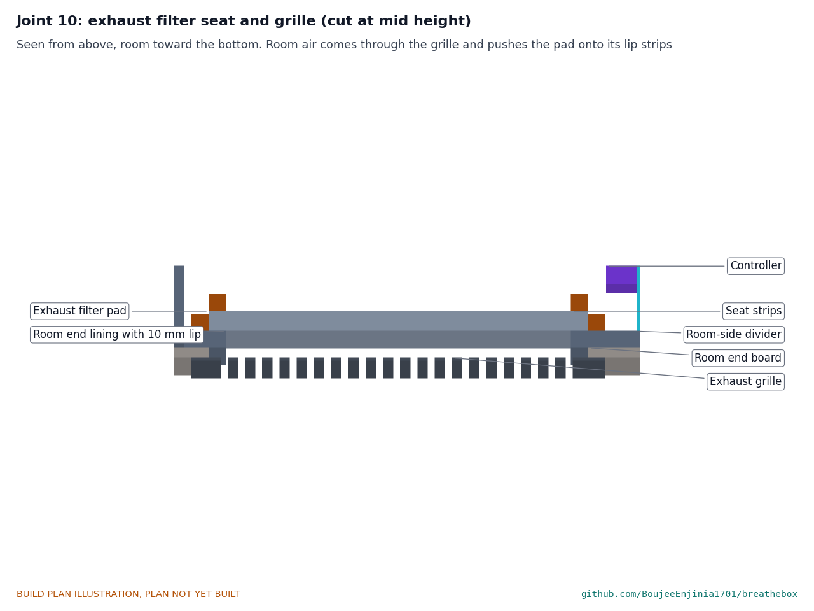

*Figure 13a. Room air comes through the grille and the lining's 10 mm lip, and pushes the pad onto its lip strips.*

The air pushes each filter onto its lips, and the lid's foam blocks press on the top edges, so no air goes round a filter. With the lid off, each filter lifts straight out by hand.

**Check before moving on.** Each filter slides down into its seat and sits square on its lips and stop.

### 3.8 Controls and power entry

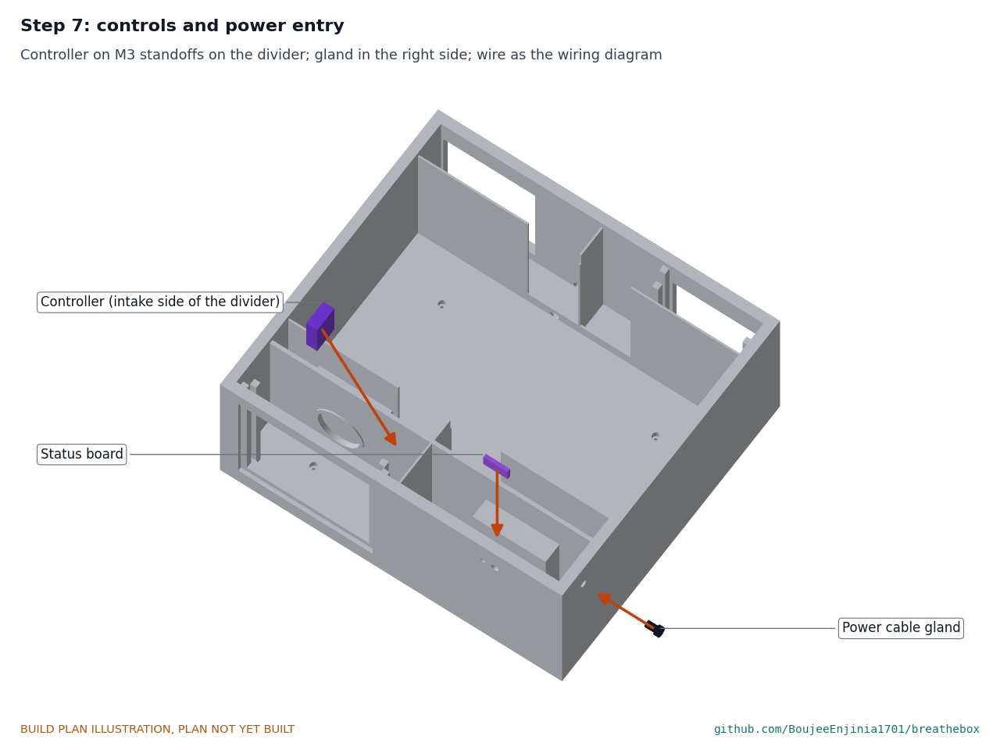

*Figure 14. Controller on the room-side divider, in the room-air intake; status board behind the room face; cable gland in the right side.*

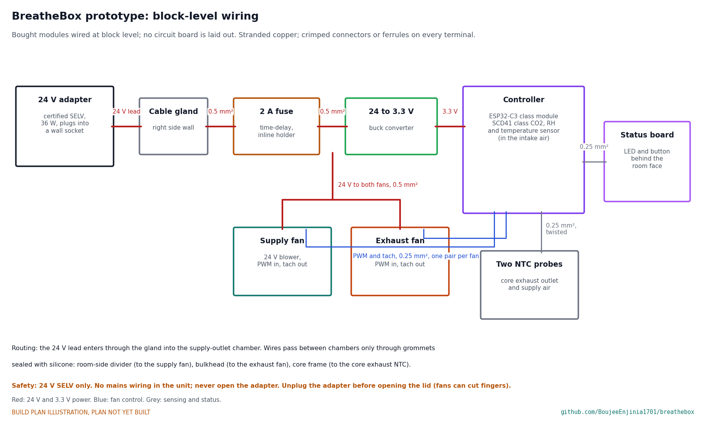

*Figure 15. Block-level wiring with wire sizes. No circuit board is laid out at this stage; bought modules are wired together.*

**What it is and what it is made from.** Bought parts: an ESP32-C3 class controller module, a Sensirion SCD41 class CO2, humidity and temperature sensor, a 24 to 3.3 V buck converter, two NTC probes, a status LED and a push button on a small board, an M12 cable gland, and an inline 2 A time-delay fuse holder.

**How to make it.**

1. Mount the controller and sensor on a small carrier board on M3 nylon standoffs on the left face of the room-side divider, 10 to 50 from the bulkhead and 144 to 204 up from the floor lining.
2. Mount the LED and button on a small board behind the two holes in the room end, so they show through.
3. Fit the cable gland in the right side wall; bring the adapter cable in through it, with the fuse holder inside.
4. Wire as Figure 15. Pass wires between chambers only through rubber grommets, sealed with silicone: through the room-side divider to the supply fan, through the bulkhead to the exhaust fan, and through the outdoor core frame to the core exhaust NTC, which is taped at the core's exhaust outlet (outdoor end, left half).

**How it fits the parts next to it.** The sensor sits in the air coming in from the room, behind the exhaust filter, as the concept requires.

**Check before moving on.** Every wire is continuous end to end and labelled; with the fuse out, the 24 V input reads open to the case.

### 3.9 Condensate tray and drain tube

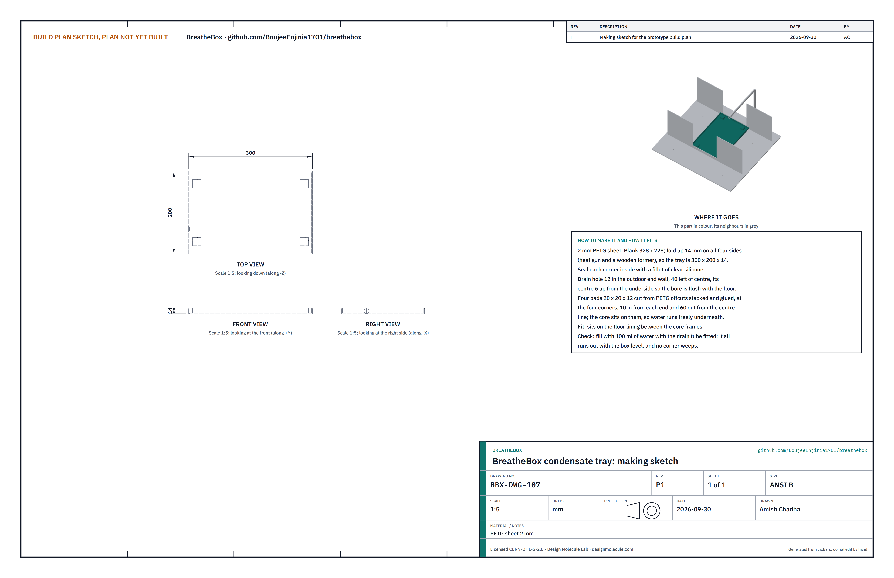

*Figure 16. Condensate tray making sketch (BBX-DWG-107).*

**What it is and what it is made from.** A shallow tray under the core that catches condensate and drains it outdoors through a silicone tube. 2 mm PETG sheet; 12 x 8 silicone tube.

**How to make it.**

1. Cut a PETG blank 328 x 228. Fold up 14 on all four sides with a heat gun over a wooden former, so the tray is 300 x 200 x 14. Seal each corner inside with clear silicone.
2. Drill a 12 hole in one short end wall, 40 left of centre, its centre 6 up from the underside, so the tube's bore is flush with the tray floor.
3. Cut four pads 20 x 20 x 12 (stacked PETG offcuts) and glue them in the corners, 10 in from each end and 60 out from the centre line.
4. Cut the tube about 450 long; push one end through the tray hole flush with the inside face and seal it.

**How it fits the parts next to it.**

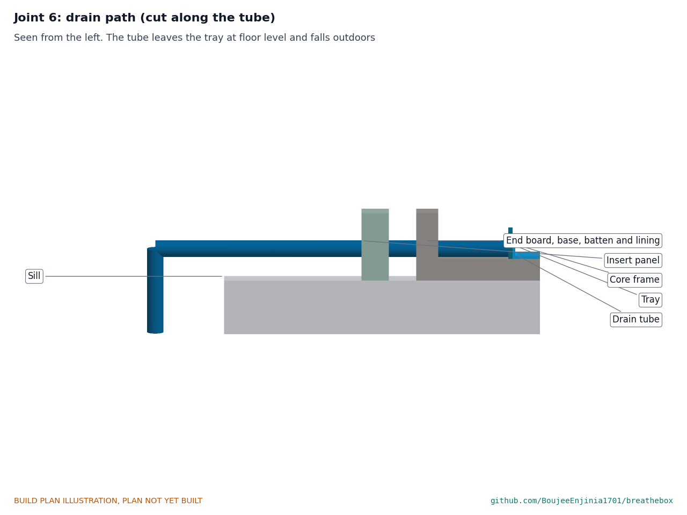

*Figure 17. Seen from the left: the tube leaves the tray at floor level, passes through the core frame, the end wall and the insert panel, and turns down outdoors.*

The tray sits on the floor lining between the core frames; the core sits on its pads. The tube runs through the outdoor core frame, the outdoor end wall and the insert panel, and hangs down the outside wall, falling all the way.

**Check before moving on.** With the box level, 100 ml of water poured into the tray all runs out of the tube, and no corner weeps.

### 3.10 Grilles

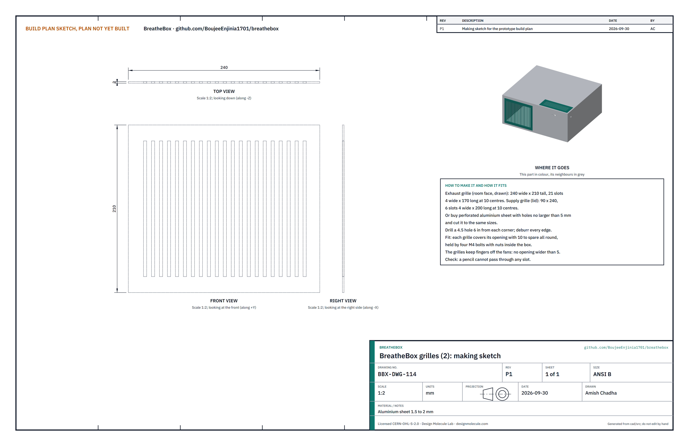

*Figure 18. Grilles making sketch (BBX-DWG-114); the exhaust grille is drawn.*

**What it is and what it is made from.** Two guards over the room openings that keep fingers off the fans. Aluminium sheet 1.5 to 2 mm, slotted, or perforated aluminium sheet with holes no larger than 5.

**How to make it.**

1. Exhaust grille: 240 wide x 210 tall, 21 slots 4 wide x 170 long at 10 centres.
2. Supply grille: 90 x 240, six slots 4 wide x 200 long at 10 centres.
3. Drill a 4.5 hole 6 in from each corner; deburr every edge and slot.

**How it fits the parts next to it.** Each grille covers its opening with 10 to spare all round and is held by four M4 bolts with nuts inside the box: the exhaust grille on the room face, the supply grille on the lid over its 70 x 220 opening.

**Check before moving on.** A pencil cannot pass through any slot.

### 3.11 Lid

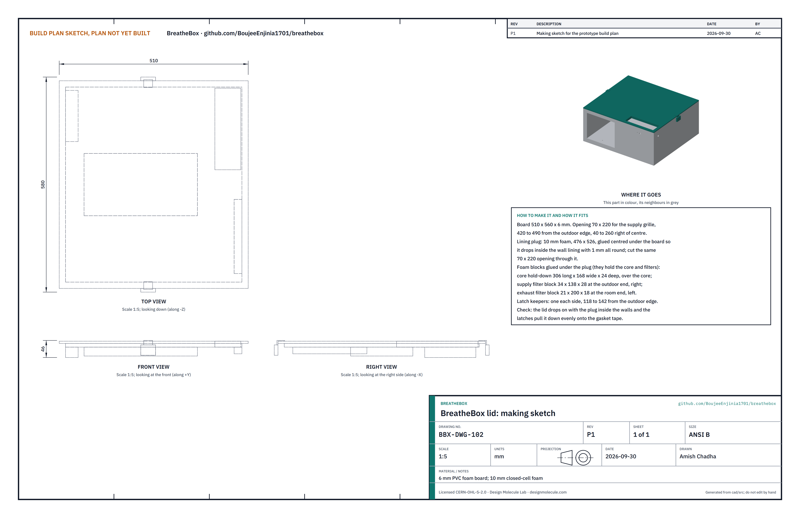

*Figure 19. Lid making sketch (BBX-DWG-102).*

**What it is and what it is made from.** The lift-off top: a board, a foam lining plug, foam blocks that hold the core and the filters, and two latch keepers. 6 mm PVC foam board; 10 mm closed-cell foam; two small stainless toggle latches with keepers.

**How to make it.**

1. Cut the board 510 x 560 and an opening 70 x 220, from 420 to 490 from the outdoor edge and 40 to 260 right of centre.
2. Cut the foam plug 476 x 526 with the same opening, and glue it centred under the board.
3. Glue foam blocks under the plug: a core hold-down 306 long x 168 wide x 24 deep, centred over the core's position; a supply filter block 34 x 138 x 28 at the outdoor end, right; an exhaust filter block 21 x 200 x 18 at the room end, left.
4. Fit the latch keepers to the board 118 to 142 from the outdoor edge, one each side, and the latches to the side walls under them.
5. Run 3 mm foam gasket tape along the top edges of the walls.

**How it fits the parts next to it.**

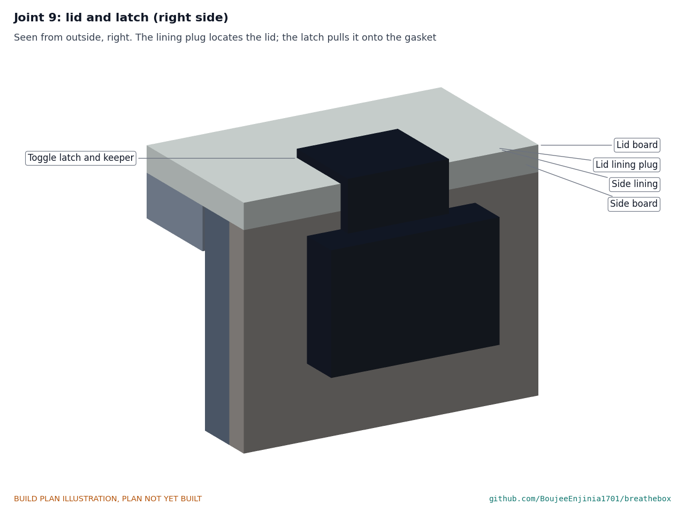

*Figure 20. The lining plug drops inside the walls with 1 mm all round; the latch pulls the lid down onto the gasket.*

**Check before moving on.** The lid drops on without force, and the latches close with the gasket evenly squeezed.

### 3.12 Struts

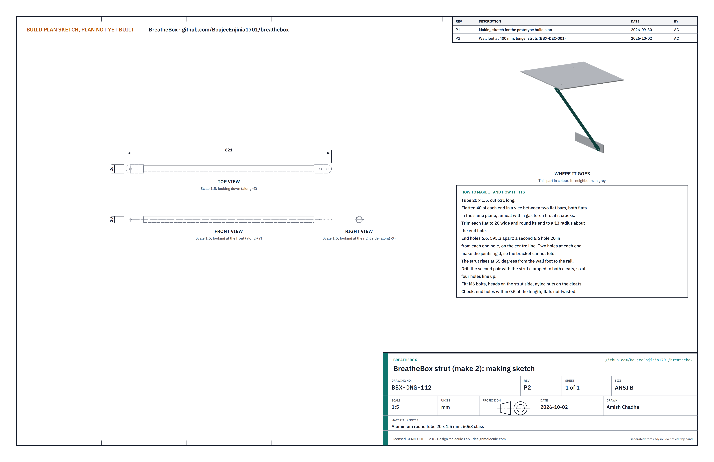

*Figure 21. Strut making sketch (BBX-DWG-112), drawn laid flat. Make two.*

**What it is and what it is made from.** The diagonal members that carry the room end of the unit to the wall foot. Aluminium round tube 20 x 1.5, 6063 class.

**How to make it.**

1. Cut two tubes 621 long.
2. Flatten 40 of each end in a vice between two flat bars, both flats in the same plane. If the tube cracks, anneal the ends with a gas torch first.
3. Trim each flat to 26 wide and round its end to a 13 radius.
4. Drill a 6.6 hole in each flat, 595.3 apart (end to end), centred 13 from each end.
5. Clamp the strut to its top cleat and its foot cleat in place, and drill the second 6.6 hole in each flat, 20 in from the first, through the strut and the cleat together.

**How it fits the parts next to it.** The top flat bolts to the inside face of the top cleat's upright leg, the bottom flat to the inside face of the foot cleat, two M6 bolts at each end, heads on the strut side and nyloc nuts on the cleat (Figures 5 and 23). The strut rises at about 55° from the foot to the rail.

**Check before moving on.** End holes 595.3 apart within 0.5; the flats are not twisted.

### 3.13 Wall foot

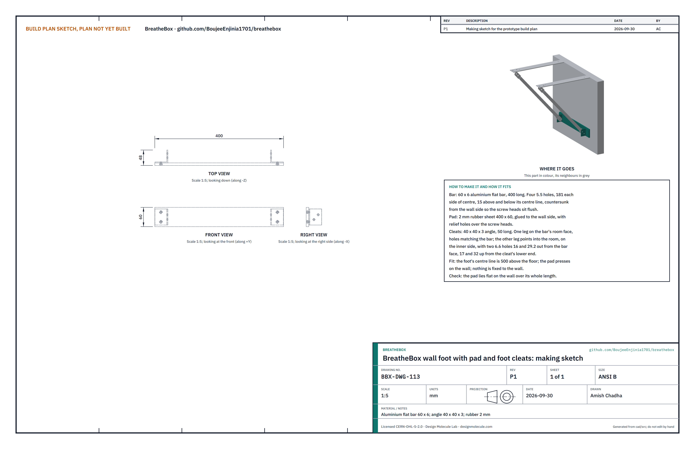

*Figure 22. Wall foot with pad and foot cleats making sketch (BBX-DWG-113).*

**What it is and what it is made from.** A padded bar that presses on the wall below the window and takes the bracket's push. Aluminium flat bar 60 x 6, two 40 x 40 x 3 angle cleats, and 2 mm rubber sheet.

**How to make it.**

1. Cut the bar 400 long. Drill four 5.5 holes, 181 each side of centre, 15 above and below the bar's centre line, and countersink them from the wall side.
2. Cut two cleats 50 long. Bolt one leg of each to the bar's room face with two M5 countersunk screws and nyloc nuts, the other leg pointing into the room on the inner side.
3. Mark the cleats' strut holes, 16 and 27.5 out from the bar face and 17 and 33.4 up from the cleat's lower end, and drill them with the strut in place (section 3.12).
4. Glue the 400 x 60 rubber pad to the wall side, with relief holes over the screw heads.

**How it fits the parts next to it.**

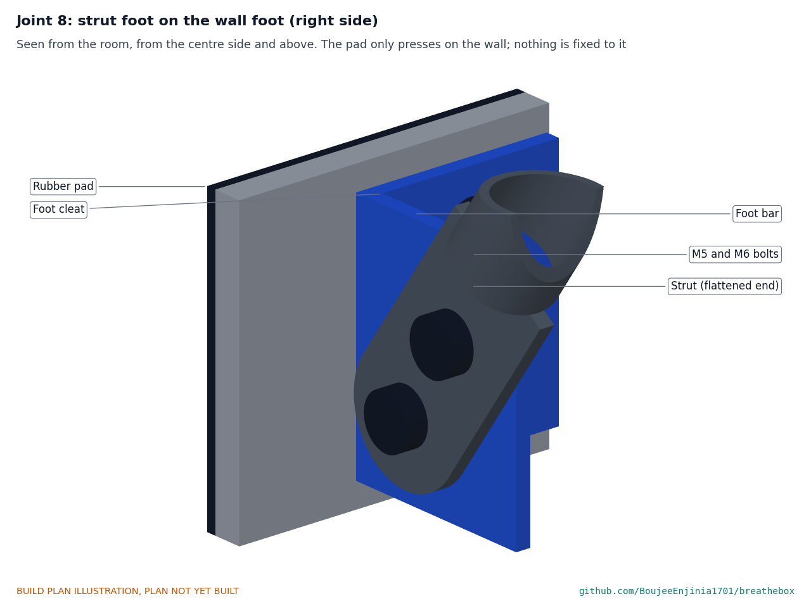

*Figure 23. The strut's lower flat bolts to the foot cleat with two M6 bolts; the pad only presses on the wall.*

The foot's centre line is 400 above the floor, so the wall below the window must be clear from about 370 to 430 above the floor (no radiator or skirting there). Nothing is fixed to the wall.

**Check before moving on.** The pad lies flat on the wall along its whole length.

### 3.14 Window insert panel

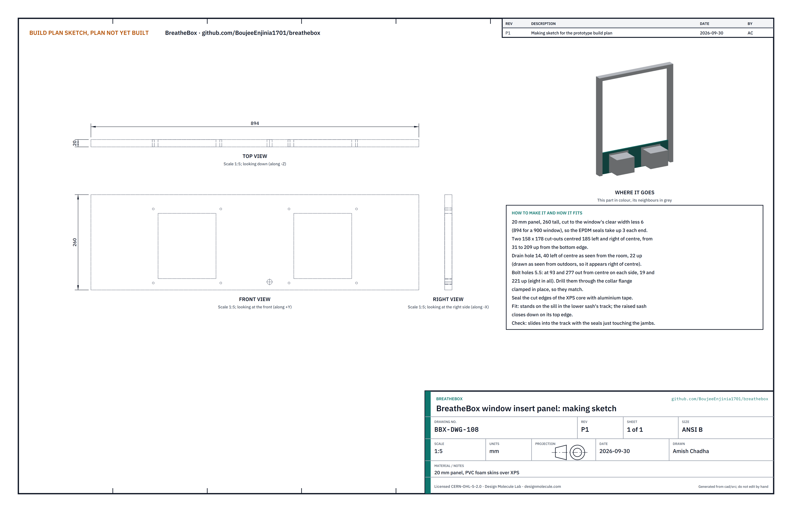

*Figure 24. Insert panel making sketch (BBX-DWG-108), drawn as seen from outdoors.*

**What it is and what it is made from.** The panel that fills the gap under the raised lower sash. A 20 mm insulated panel with PVC foam skins over an XPS core, and compressible EPDM seal strip at each end.

**How to make it.**

1. Cut the panel 260 tall and as long as the window's clear width less 6 (894 for a 900 window).
2. Cut two 158 x 178 openings, centred 185 left and 185 right of centre, from 31 to 209 up.
3. Drill a 14 hole 40 left of centre (as seen from the room), 22 up.
4. Seal the cut XPS edges with aluminium tape. Stick EPDM seal strip to both ends.
5. Leave the eight bolt holes until the collars are made; they are drilled through the collar flanges (section 3.15).

**How it fits the parts next to it.** It stands on the sill in the lower sash's track; the raised sash closes down on its top edge; its end seals press on the jambs.

**Check before moving on.** It slides into the track with the seals just touching the jambs.

### 3.15 Collars

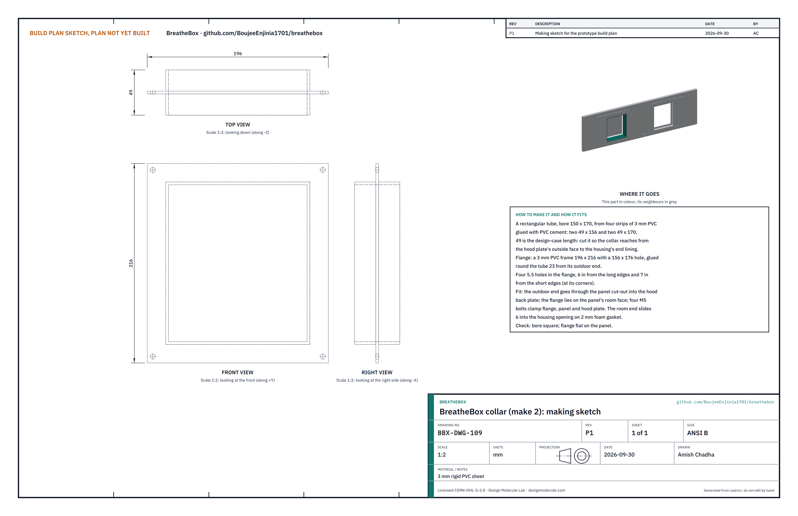

*Figure 25. Collar making sketch (BBX-DWG-109). Make two.*

**What it is and what it is made from.** A short rectangular duct through the panel on each side, which joins a hood to the housing. 3 mm rigid PVC sheet.

**How to make it.**

1. Cut four strips: two 49 x 156 and two 49 x 170. Glue them into a tube with a 150 x 170 bore using PVC cement. 49 is the length for the design-case window: cut it so that the collar reaches from the outer face of the hood back plate to the housing's end lining.
2. Cut a flange: a frame 196 x 216 with a 156 x 176 hole. Glue it round the tube 23 from its outdoor end.
3. Drill four 5.5 holes in the flange corners, 6 in from the long edges and 7 in from the short edges.
4. Clamp the flange to the panel's room face, the tube through the panel opening, and drill the panel through the flange holes.

**How it fits the parts next to it.**

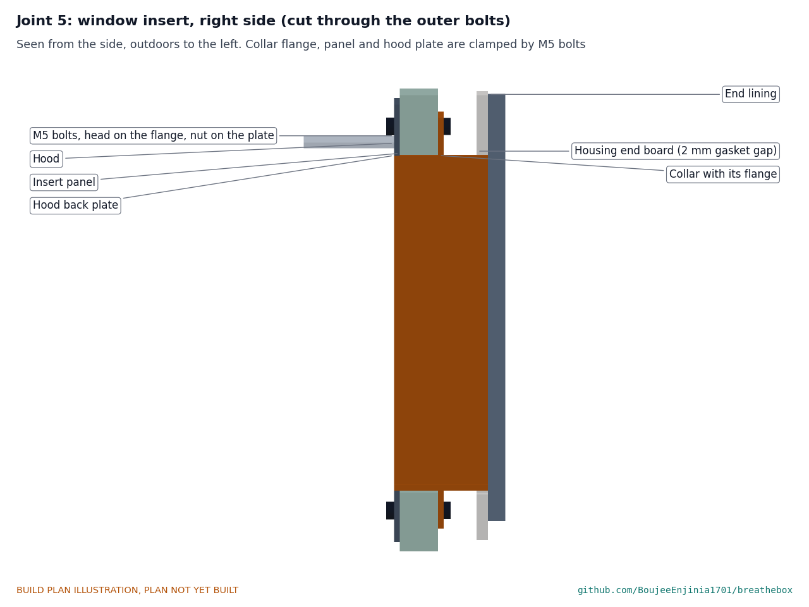

*Figure 26. Cut through the outer bolts: collar flange, panel and hood back plate are clamped by M5 bolts; the collar passes through and slides into the housing's opening.*

The outdoor end of the collar fits the hood back plate's opening and is glued there. The flange lies on the panel's room face. The room end slides 6 into the housing's opening on 2 mm foam gasket tape and stops against the end lining.

**Check before moving on.** The bore is square, and the flange lies flat on the panel.

### 3.16 Hoods

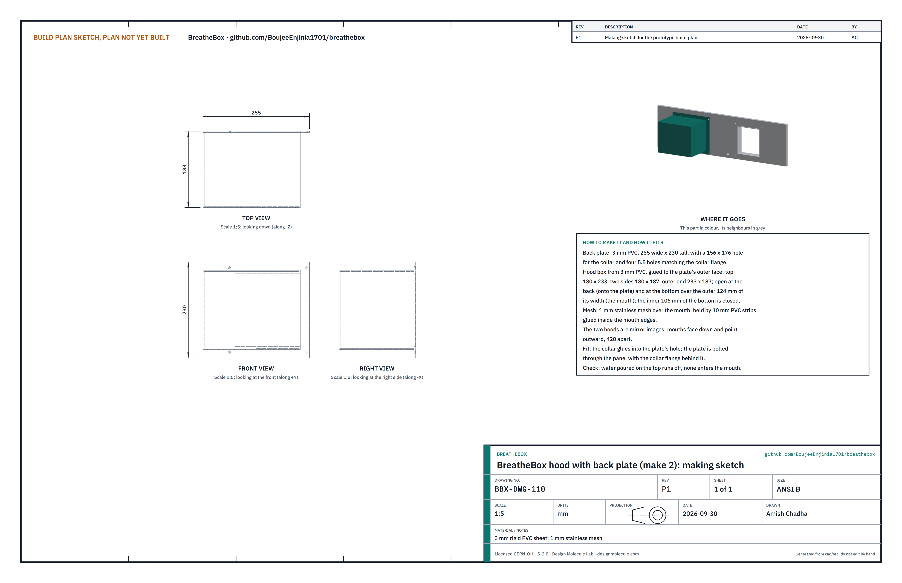

*Figure 27. Hood with back plate making sketch (BBX-DWG-110). Make two, mirror images.*

**What it is and what it is made from.** A box on the outdoor face of the panel that turns each air stream to face down, with insect mesh over its mouth. 3 mm rigid PVC sheet; 1 mm stainless mesh.

**How to make it.**

1. Back plate: 255 wide x 230 tall, with a 156 x 176 hole for the collar and four 5.5 holes matching the collar flange (drill through the flange).
2. Hood box: a top 180 x 233, two sides 180 x 187 and an outer end 233 x 187. Glue them to each other and to the back plate's outer face with PVC cement. The box is open at the back, onto the plate, and open at the bottom over its outer 124 of width (the mouth); close the inner 106 of the bottom with a strip of sheet.
3. Glue the mesh over the mouth, held by 10 mm PVC strips glued inside the mouth edges.
4. Make the second hood as the mirror image, so both mouths point outward, 420 apart.

**How it fits the parts next to it.** The collar glues into the back plate's hole. Four M5 bolts per side pass through the collar flange, the panel and the back plate, heads on the flange and nyloc nuts on the plate (Figure 26).

**Check before moving on.** Water poured on the top runs off; none enters the mouth.

### 3.17 Bought components

Buy to specification, not brand. Line numbers are those of the bill of materials.

- **Counterflow core (line 2).** Polymer plate core 180 x 180 x 300, about 2.5 plate pitch, washable, with each end face split into two halves along its centre line, one half per air stream.
- **Fans (lines 3 and 4).** Two 24 V brushless centrifugal blowers, 120 x 120 x 32 class, about 100 m³/h free air and 400 Pa shut-off, PWM input and tach output, inlet ring no more than 80 across.
- **Supply filter (line 5).** ISO 16890 ePM1 50 % pleated panel, 150 x 170 x 25, with a frame at least 5 wide.
- **Exhaust filter (line 6).** Coarse washable pad, 220 x 190 x 12.
- **Controller (line 7).** As section 3.8.
- **Adapter (line 12).** Certified 24 V DC, 1.5 A (36 W) plug-in SELV adapter with a 3 m low-voltage lead.
- **Sash jammer (line 14).** A no-drill adjustable sash jammer or window security bar: a telescopic bar about 22 square with rubber end pads, adjustable to at least the gap between the top of the raised lower sash and the window head (about 340 on the trial window). Nothing to make; check that it locks at that length and that its pads do not touch the glass.
- **Fixings and sundries (line 13).** Stainless: 8 M5 x 35 bolts for the hoods, 4 M5 x 20 bolts for the rails, 8 M5 x 12 countersunk screws for the cleats, 8 M6 x 16 bolts for the struts, all with nyloc nuts and washers; M4 bolts for the grilles; M4 nylon screws and rubber grommets for the fans; 3.5 x 16 screws for the battens; M12 cable gland; 3 mm foam gasket tape; anti-slip rubber tape; PVC cement; contact adhesive; clear silicone; aluminium tape; cable ties; connectors; 2 A time-delay fuse and inline holder.

## 4. Putting it together

In each picture the parts already fitted are grey and the part being fitted is in colour, with an arrow showing the way it goes in.

### Step 1: boards and corner battens

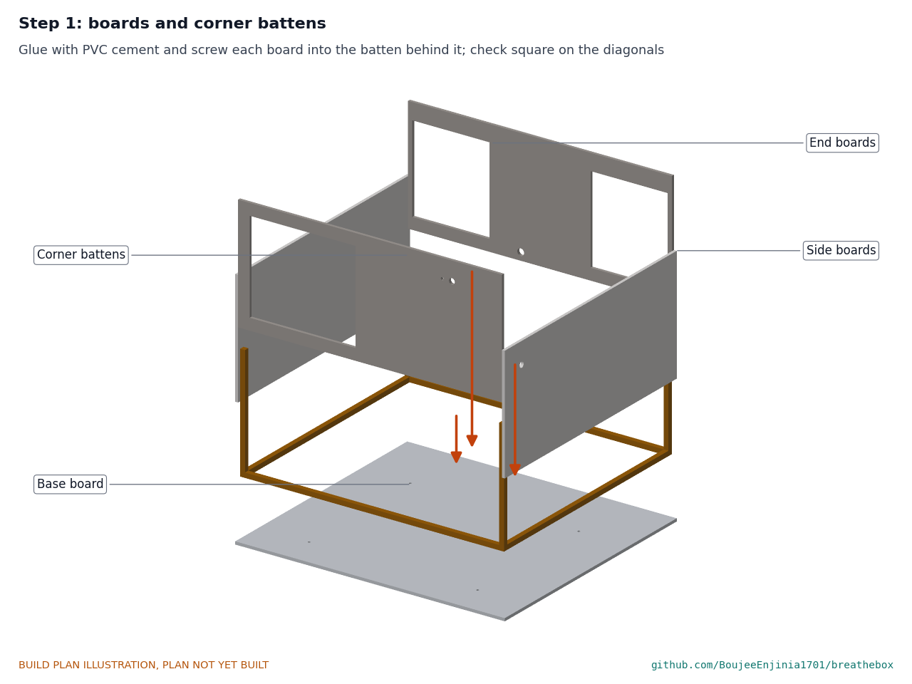

Glue and screw the battens, sides and ends onto the base (section 3.1). Check square before the glue sets.

### Step 2: bracket rails under the base

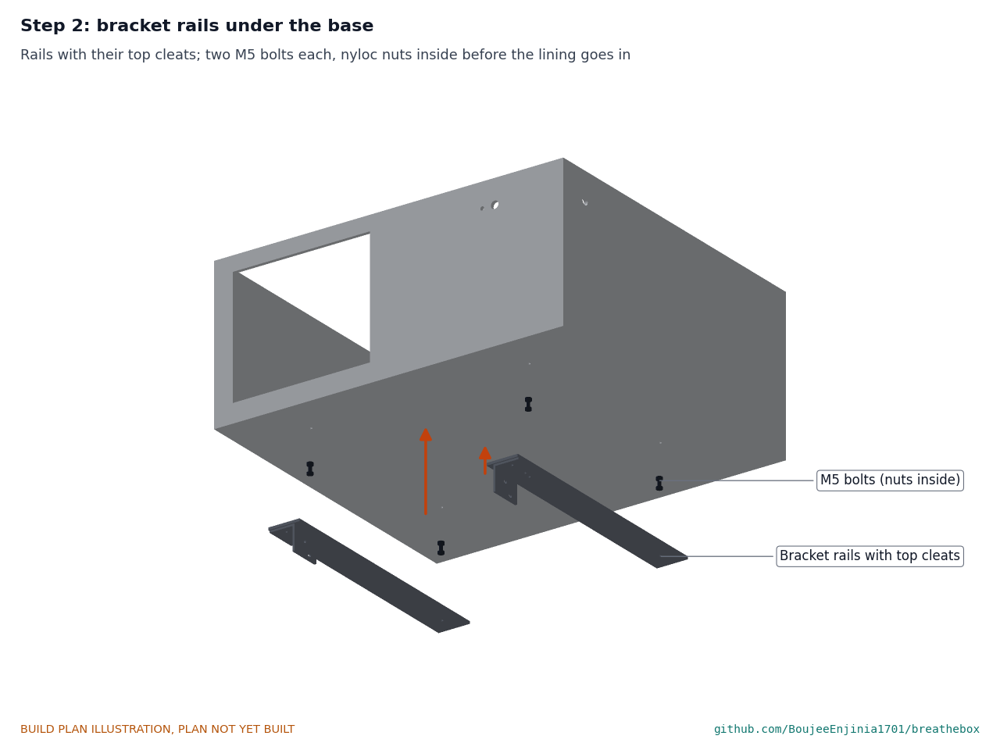

Two M5 bolts per rail from below, penny washers and nyloc nuts inside. Tighten now: the lining covers the nuts.

### Step 3: foam lining

Floor first, then sides, then ends (section 3.3).

### Step 4: core frames, dividers and fan bulkhead

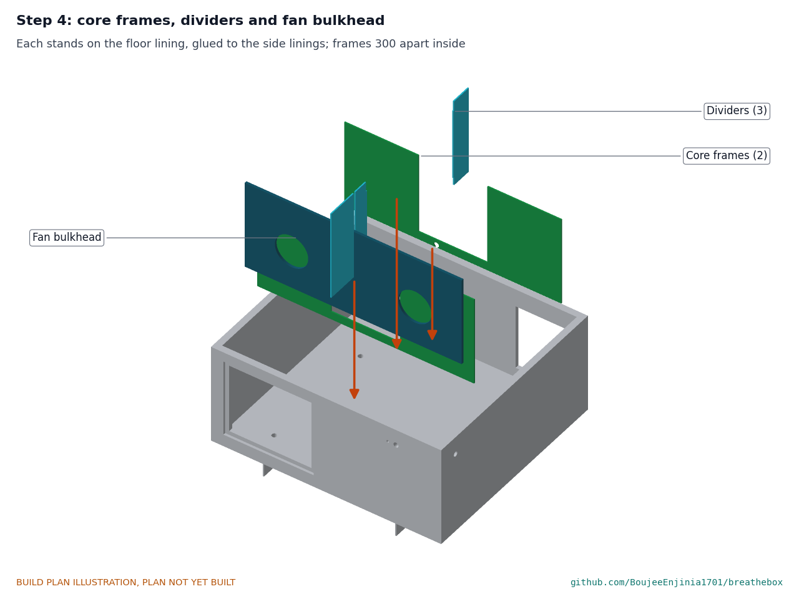

Stand each on the floor lining and glue it to the side linings: core frames 300 apart inside, then the bulkhead, then the dividers between them. Use the core as a spacer while the frames' glue sets.

### Step 5: filter seat strips and stops

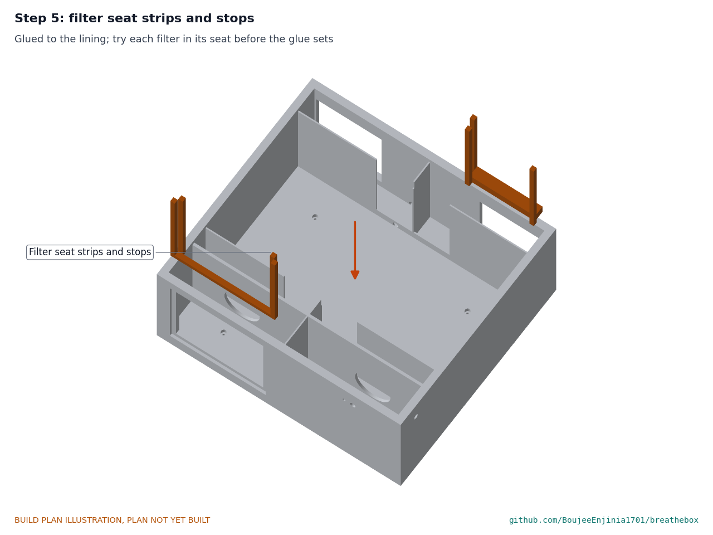

Glue them in with each filter in place (section 3.7), then lift the filters out.

### Step 6: fans onto the bulkhead

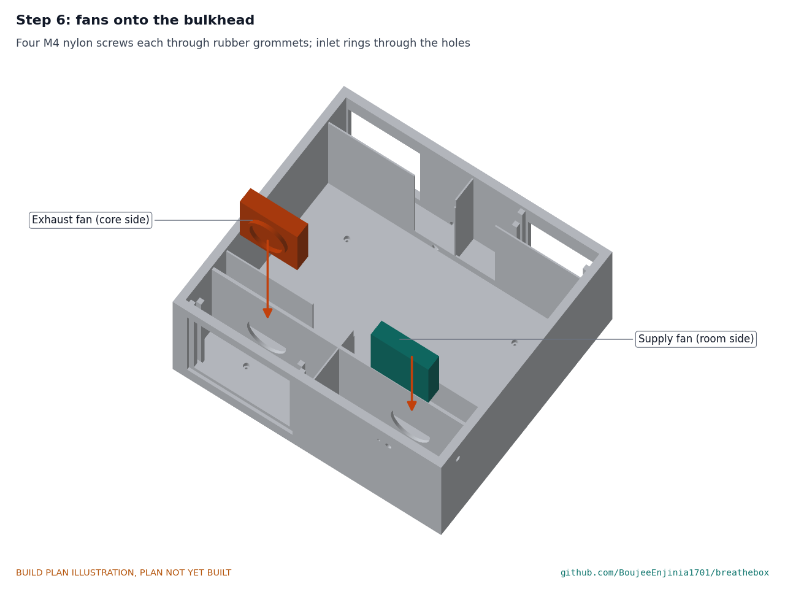

Supply fan on the room side, right; exhaust fan on the core side, left; each inlet ring through its hole. Four M4 nylon screws each through rubber grommets, snug, not tight.

### Step 7: controls and power entry

Fit and wire as section 3.8. **Hold point:** the wiring checks of section 3.8 pass before going on.

### Step 8: condensate tray and drain tube

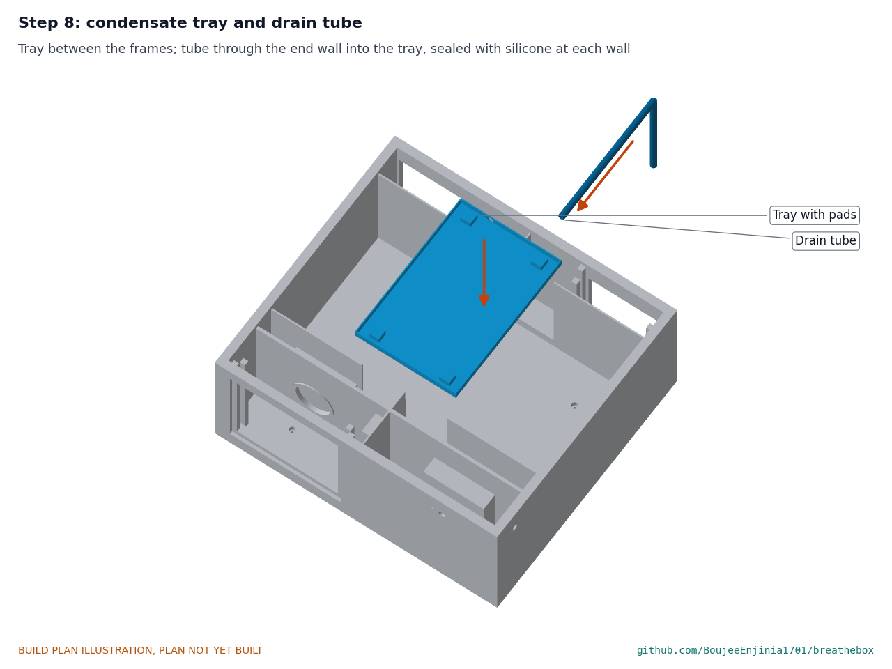

Set the tray between the core frames. Feed the tube out through the core frame and the end wall, and seal it at each wall with silicone.

### Step 9: counterflow core

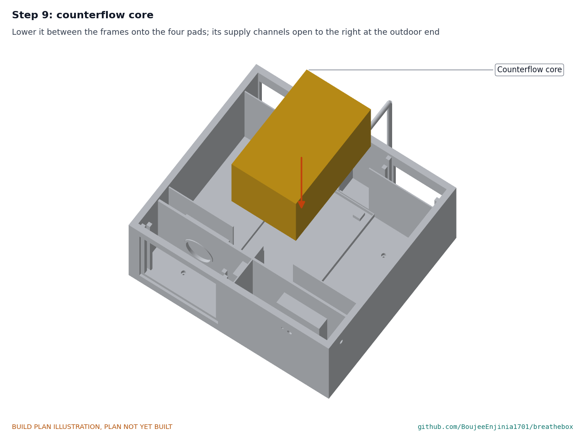

Lower the core between the frames onto its pads, with the supply half of its outdoor end on the right, as the core's maker marks it.

### Step 10: filters into their seats

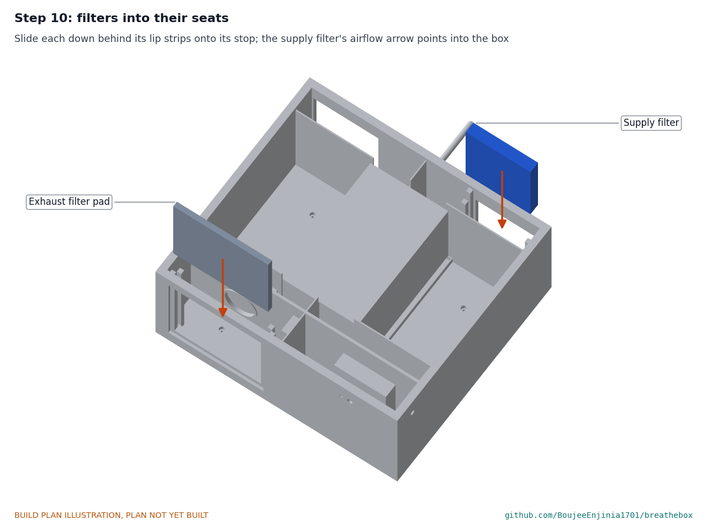

Slide each down behind its lip strips onto its stop, with the supply filter's airflow arrow pointing into the box.

### Step 11: grilles

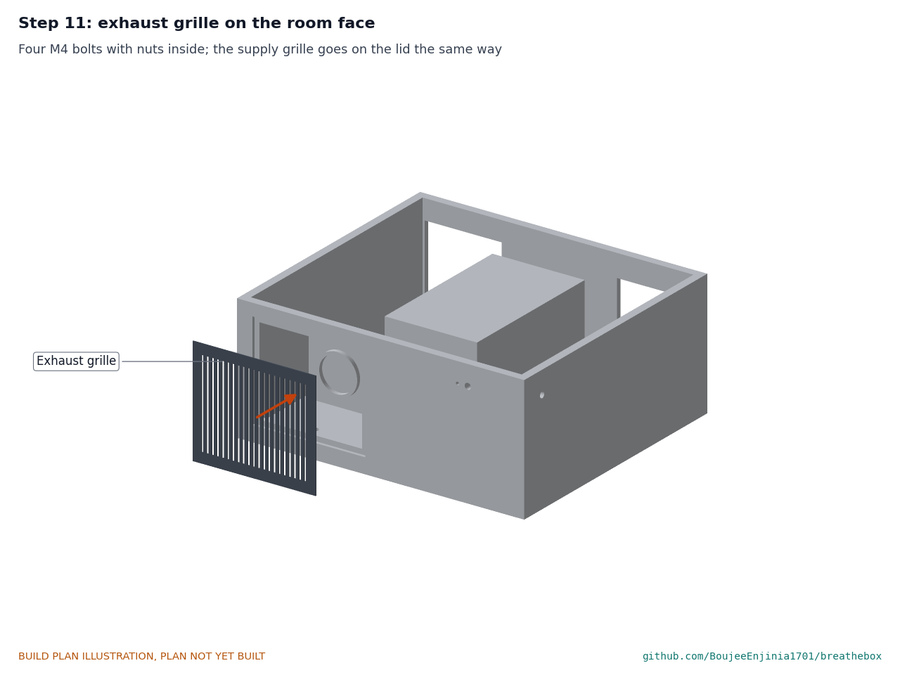

Exhaust grille on the room face and supply grille on the lid, four M4 bolts each, nuts inside.

### Step 12: lid on, latches closed

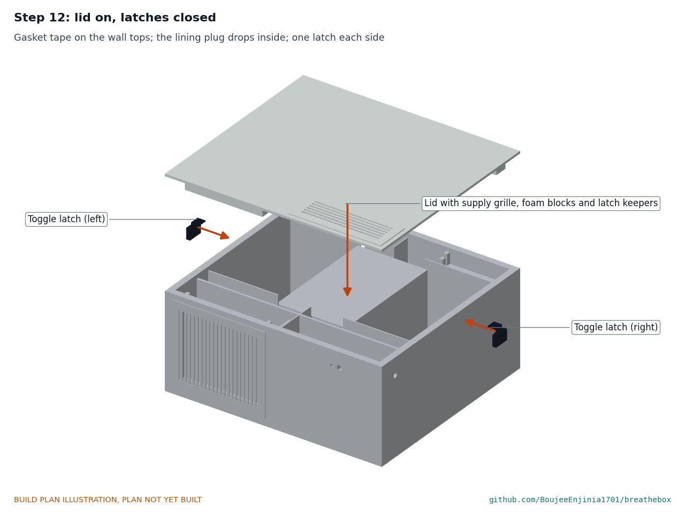

Check the gasket tape is whole and no wire lies across a wall top. Drop the lid on and close both latches. **Hold point:** first checks with power (section 5) are done with the lid on.

### Step 13: struts and wall foot

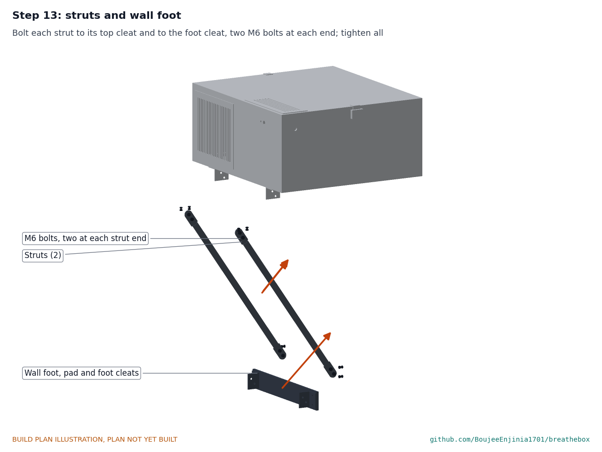

Bolt each strut to its top cleat and to the foot cleat, two M6 bolts at each end, and tighten all. The unit, bracket and foot are now one rigid piece of about 9 kg. The struts now rise steeply, at about 55°, because the foot sits 400 above the floor.

### Step 14: window insert on the bench

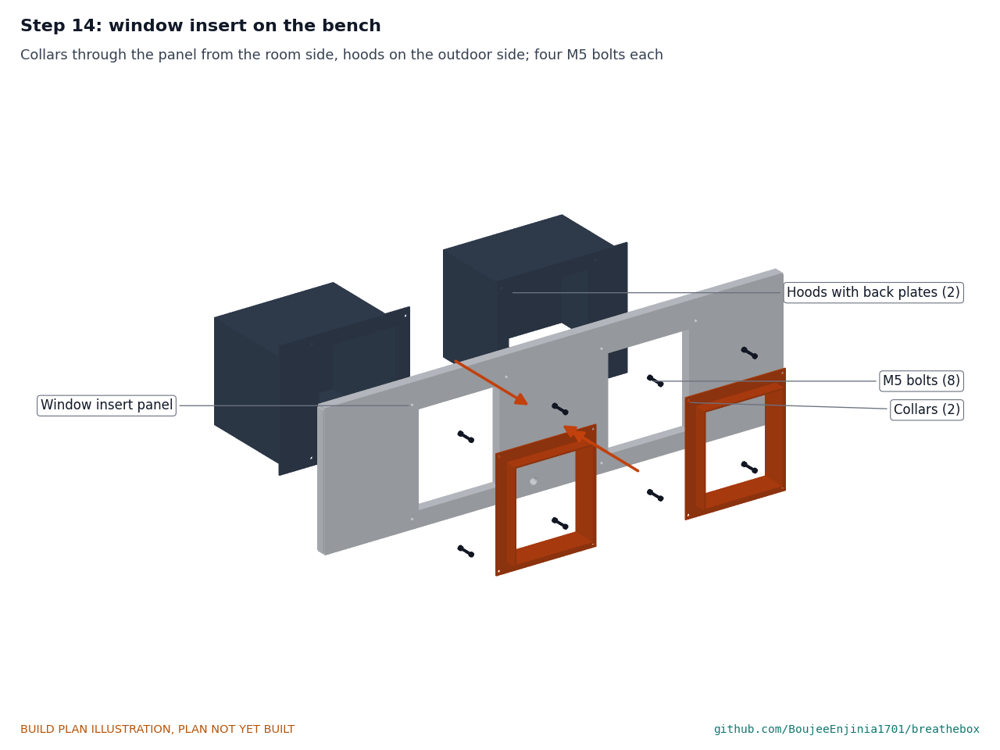

Collars through the panel from the room side, hoods on the outdoor side, four M5 bolts per side through flange, panel and back plate. Feed the drain tube through the panel's hole.

### Step 15: insert into the window, sash jammer fitted

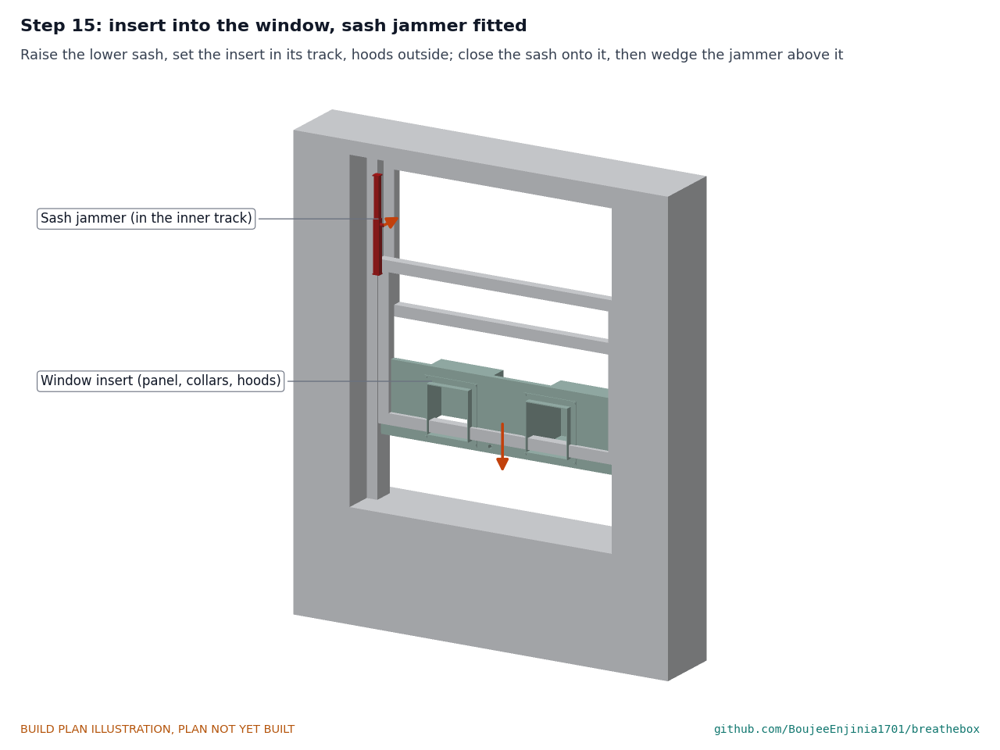

From inside, raise the lower sash fully, pass the hoods out under it, and stand the panel in the lower sash's track with the hoods outside. Close the sash down onto the panel. Then set the sash jammer upright in the inner track, between the top of the lower sash and the window head, near one jamb; extend it until both rubber pads bear firmly and lock it. Try to lift the lower sash: it must not move. **Hold point:** safety stop S4.

### Step 16: unit onto the sill

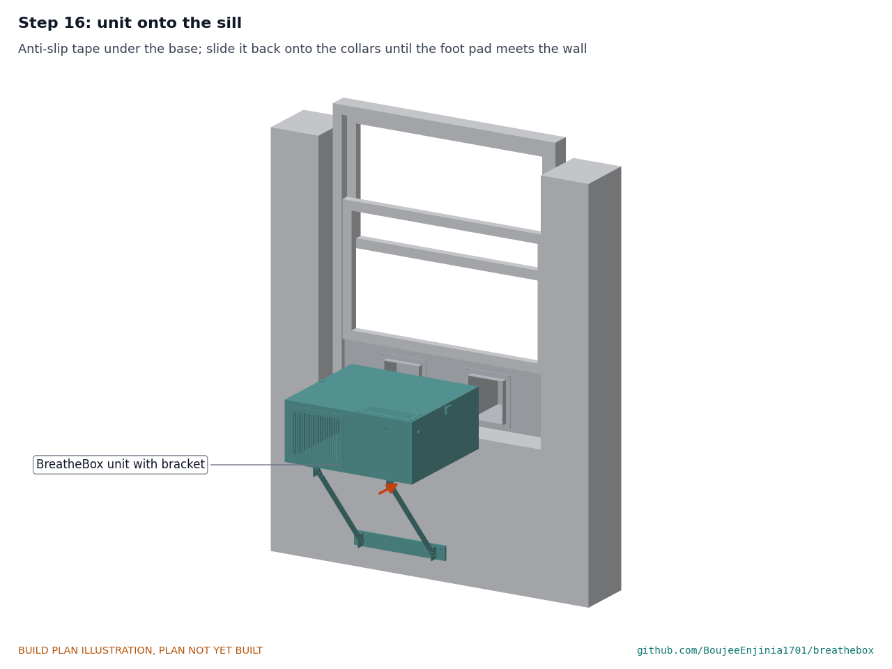

Stick anti-slip tape under the housing base where it sits on the sill. With a helper, set the unit on the sill and slide it back so the collars enter the housing openings, until the foot pad meets the wall. Plug in the adapter last.

## 5. First checks

These are the checks a TRL 4 test report would record; this plan only lists them. Requirement numbers are those of BBX-REQ-001.

*Table 2. First checks.*

| Check | Requirement | How | Pass when |
| --- | --- | --- | --- |
| Air paths sealed | R1, R2 | Lid off, fans off; smoke pencil along every frame, divider and bulkhead edge with a small fan blowing into one chamber | No smoke crosses into another chamber |
| Filters and core out | R13 | Time removing the lid, both filters and the core by hand, and refitting them | Filters out and back in 2 min or less; core out without tools |
| Supply and power | R10 | Adapter's label; meter on the 24 V input with the fuse in; both fans at full speed | 24 V SELV, certified; input under 1.5 A |
| Fans run and report | R1 | Run each fan from the controller at low and full speed with the lid on | Each turns the right way, and its tach reading follows its speed |
| Balance | R1 | Flow hood or vane anemometer on both grilles at 50 m³/h | Supply and exhaust within 10 % |
| Cross-leakage in the core | R4 | Release CO2 as a tracer into the exhaust stream at the room grille; measure CO2 in the supply air at the top grille and in the room air, at 50 m³/h | Under about 3 % of the exhaust CO2 rise reaches the supply air |
| Drain | R7 | 100 ml of water into the tray with the unit on the sill | All of it reaches the end of the tube outdoors |
| Openings | R12 | Probe each grille and hood mouth | No opening wider than 5 at the grilles; mesh whole |
| Hood spacing and mesh | R11 | Measure between the inner edges of the two mouths | 420 or more; mesh 1.5 or finer |
| Window fit | R8 | Fit the insert in the trial window | Seals touch both jambs; the sash closes down onto the panel |
| Sash held down | R12 | With the sash jammer locked, lift the lower sash by hand from inside | The sash does not lift off the panel |
| Stays put on the sill | R9 | Push the room face toward the room with 50 N (a luggage scale) | Nothing moves |
| Mass | R9 | Weigh the unit with its bracket, the insert and the sash jammer | 12 kg or less together (11.8 kg estimated) |
| Install time | R9 | Time one person fitting the insert and the unit | 30 min or less |

## 6. Safety stops

Stop at each point. Carry on only when everything listed is true.

- **S1. Before cutting and gluing.** A ventilated space for PVC cement and contact adhesive; no flames near solvents; safety glasses and a cut-resistant glove for knife work.
- **S2. Before first power.** The adapter is a certified, undamaged 24 V SELV unit; the 2 A fuse is in its holder; the 24 V polarity at the controller is checked with a meter; the lid is on and latched, and both grilles are fitted.
- **S3. Whenever the lid comes off.** The adapter is unplugged first. Never run the fans with the lid off.
- **S4. Before fitting the insert in a window.** All eight insert bolts are tight; the work is done from inside only, never from outside a window above ground level; the hoods are held until the panel stands in its track and the sash is down on it and held by the locked sash jammer.
- **S5. Before running the unit in a room.** The room has no open-flued or unflued fuel-burning appliance (gas fire, stove, water heater), and its door has an undercut or gap, so frost mode cannot depressurise it much. The push test of section 5 has passed.
- **S6. Leaving it running.** This plan builds a supervised test prototype: do not leave it in a window unattended, and keep the adapter cable clear of the sash and of the drain tube.

## 7. Tools, skills and workspace

**Tools.** Steel rule, square and sharp utility knife with spare blades; fine-tooth saw and mitre box for strip; drill with 2.5 to 14 bits and a 81 hole saw; countersink; hacksaw with a 24 teeth per inch blade; bench vice with soft jaws and two flat bars for flattening the strut ends; files and a deburring tool; heat gun and a wooden former for the tray; gas torch (for annealing, if needed); spanners and hex keys for M4 to M6; screwdrivers; clamps; glue spreader; silicone gun; multimeter; digital angle finder; luggage scale to 25 kg; smoke pencil or incense stick; stopwatch.

**Skills.** No certified trade is needed. Accurate marking and knife cutting, basic drilling and filing of aluminium, gluing plastics, and plugging together low-voltage modules. All wiring in the unit is 24 V or lower, from a certified adapter; no mains wiring is part of this build.

**Workspace.** A bench about 1.2 x 0.8 m, with a ventilated corner for gluing and heat-forming; a trial sash window at ground level with a clear wall below it.

**Personal protective equipment.** Safety glasses for cutting, drilling and flattening; cut-resistant gloves for knife work and aluminium edges; heat-resistant gloves for the heat gun and torch; no gloves near a turning drill.

## 8. Where the numbers come from

- Model and constructability checks: `cad/src/model.py` (`python cad/src/model.py --check`, 90 checks); STEP and STL exports in `cad/step/` and `cad/stl/`.
- Pictures: `cad/src/build_plan_media.py`, using `.kit/build_views.py`; written to `docs/05-build-plan/` and `cad/drawings/BBX-DWG-101` to `BBX-DWG-114`.
- General arrangement: `cad/drawings/BBX-DWG-001.pdf`, Rev P4.
- Calculations: `docs/04-calcs/01-sizing.md` (BBX-CAL-001 v0.7) and `docs/04-calcs/sizing.py`; mass, stability, pressure and power in sections 3, 4 and 8.
- Bill of materials: `bom/bom.csv` and `bom/bom-notes.md`.
- Decisions: `docs/decisions/0003-design-for-construction.md` (BBX-DDR-003), with BBX-DDR-001 and BBX-DDR-002; decisions made and items to confirm in `docs/06-design-decisions.md` (BBX-DEC-001).
- Requirements: `docs/03-requirements.md` (BBX-REQ-001 v0.9).
